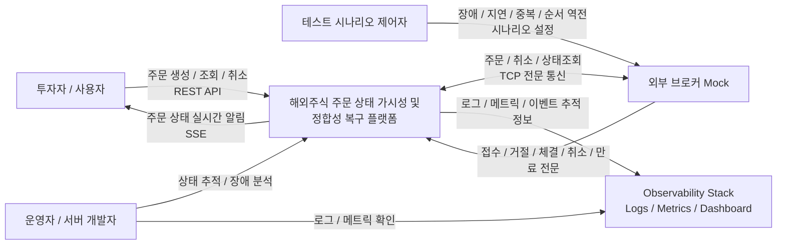

# 2. 시스템 컨텍스트 다이어그램

## 2.1 시스템 경계 정의

본 프로젝트의 System of Interest는 다음과 같다.

> **해외주식 주문 상태 가시성 및 정합성 복구 플랫폼**

이 시스템은 사용자의 해외주식 주문 요청을 받아 외부 브로커로 전달하고, 브로커로부터 수신한 주문 접수, 거절, 부분체결, 완전체결, 취소, 만료 이벤트를 내부 주문 상태로 반영한다.

또한 브로커 응답 유실, 지연, 중복, 순서 역전으로 인해 주문 상태가 불확실해질 경우, reconciliation 절차를 통해 내부 상태를 외부 브로커 상태와 최종적으로 수렴시킨다.

이 단계에서는 내부 구현 요소인 Kafka, DB, Outbox/Inbox, 개별 서비스 구조를 상세히 표현하지 않는다. 해당 내용은 이후 **아키텍처 개요**, **DB 설계**, **API / 이벤트 / 전문 명세** 단계에서 다룬다.

---

## 2.2 외부 Actor 및 외부 시스템

| 구분              | 이름                  | 역할                                                              |
| --------------- | ------------------- | --------------------------------------------------------------- |
| Actor           | 투자자 / 사용자           | 주문 생성, 주문 조회, 주문 취소, 실시간 주문 상태 확인                               |
| Actor           | 운영자 / 서버 개발자        | 주문 상태 이상 추적, 브로커 전문 송수신 이력 확인, reconciliation 결과 확인             |
| External System | 외부 브로커 Mock         | TCP 전문 기반 주문 접수, 거절, 체결, 취소, 만료, 상태조회 응답을 제공하는 simulated broker |
| External System | Observability Stack | 로그, 메트릭, 대시보드, 알림 확인을 위한 관측성 시스템                                |
| Actor/System    | 테스트 시나리오 제어자        | Broker Mock의 장애, 지연, 중복, 순서 역전 시나리오를 제어                         |

---

## 2.3 시스템 컨텍스트 다이어그램

---

## 2.4 Actor 및 외부 시스템 설명

### 2.4.1 투자자 / 사용자

투자자 또는 사용자는 시스템을 통해 해외주식 주문을 생성하고, 주문 상태를 조회하며, 필요할 경우 취소를 요청한다.

사용자에게 중요한 것은 단순히 주문 요청이 서버에 전달되었다는 사실이 아니다. 사용자는 현재 주문이 다음 상태 중 어디에 있는지 신뢰할 수 있어야 한다.

* 접수 대기
* 브로커 접수 완료
* 일부 체결
* 전량 체결
* 취소 요청 중
* 취소 완료
* 거절
* 만료
* 상태 확인 중

시스템은 주문 상태 변경을 SSE 기반 실시간 알림으로 사용자에게 전달한다.

---

### 2.4.2 운영자 / 서버 개발자

운영자 또는 서버 개발자는 주문 상태가 예상과 다르거나 `UNKNOWN`으로 진입한 경우, 시스템이 제공하는 이력과 관측성 정보를 통해 원인을 추적한다.

운영 관점에서 확인해야 하는 정보는 다음과 같다.

* 주문 상태 변경 이력
* 브로커 전문 송수신 이력
* command attempt 이력
* malformed 전문 처리 이력
* reconciliation job 이력
* Kafka 메시지 처리 실패 또는 재처리 이력
* 주요 메트릭과 로그

1차 범위에서는 고도화된 운영 콘솔 UI를 만들지 않는다. 운영 콘솔은 심화 2에서 구현한다.
다만 1차 범위에서도 운영 추적에 필요한 데이터, 로그, 메트릭은 반드시 남긴다.

---

### 2.4.3 외부 브로커 Mock

외부 브로커 Mock은 실제 브로커 또는 대외기관을 대신하는 simulated external system이다.

1차 범위에서는 실제 브로커와 연동하지 않는다. 대신 Netty 기반 TCP 서버를 구현하여 실제 금융권 전문 통신의 핵심 구조를 단순화해 재현한다.

Broker Mock은 다음 특성을 가진다.

* length-prefixed frame
* 공통 전문 header
* 고정 길이 body
* 전문 ID별 parser/serializer
* 주문 접수 / 거절 / 체결 / 취소 / 만료 / 상태조회 전문
* wireMessageId / traceId / clientOrderId / brokerOrderId 기반 correlation
* malformed 전문 처리
* 지연, 중복, 순서 역전, 무응답 시나리오 주입

Broker Mock의 목적은 실제 브로커를 완벽히 구현하는 것이 아니다.
목적은 **외부기관 연계의 불확실성을 통제된 방식으로 재현하는 것**이다.

---

### 2.4.4 Observability Stack

Observability Stack은 시스템 외부의 운영 지원 도구다.

1차 범위에서는 다음 수준의 도구를 상정한다.

* 애플리케이션 로그
* Prometheus metrics
* Grafana dashboard
* 필요 시 Loki 또는 파일 로그 기반 분석

시스템은 Observability Stack으로 다음 정보를 제공한다.

* 주문 생성 수
* 주문 상태별 개수
* 브로커 ACK 지연
* 체결 이벤트 처리 지연
* timeout 발생 수
* `UNKNOWN` 진입 수
* reconciliation 성공/실패 수
* malformed 전문 수
* Kafka publish/consume 실패 수

---

### 2.4.5 테스트 시나리오 제어자

테스트 시나리오 제어자는 일반 사용자가 아니라, 개발 및 테스트 환경에서 Broker Mock에 특정 장애 시나리오를 주입하는 actor다.

테스트 시나리오 제어자는 다음 상황을 Broker Mock에 설정할 수 있다.

* ACK 지연
* ACK 유실
* 중복 체결 이벤트
* ACK보다 체결 이벤트 먼저 전송
* 취소 중 추가 체결
* malformed 전문 응답
* 상태조회 snapshot mismatch

이 actor를 컨텍스트 다이어그램에 포함하는 이유는 명확하다.

> 이 프로젝트는 단순 정상 흐름 구현이 아니라, 외부 브로커 장애와 불확실성을 재현하고 검증하는 시스템이기 때문이다.

---

## 2.5 시스템 내부와 외부 경계

### 2.5.1 시스템 내부에 포함되는 요소

컨텍스트 다이어그램에서는 하나의 큰 시스템으로 표현하지만, 내부적으로는 다음 요소를 포함한다.

* Order Service
* Broker Gateway Service
* Recovery Service
* Kafka
* 각 서비스 DB
* Outbox / Inbox
* SSE Publisher
* 주문 상태머신
* Reconciliation Worker

이 요소들은 컨텍스트 다이어그램에서는 세부적으로 표현하지 않는다.
이후 **7. 아키텍처 개요** 단계에서 상세히 분해한다.

---

### 2.5.2 시스템 외부로 보는 요소

다음 요소는 시스템 외부로 본다.

* 투자자 / 사용자
* 운영자 / 서버 개발자
* 외부 브로커 Mock
* Observability Stack
* 테스트 시나리오 제어자

---

## 2.6 컨텍스트 경계 결정 사항

### 결정 1. Broker Mock은 시스템 외부로 표현한다

Broker Mock은 프로젝트에서 직접 구현하지만, 시스템 컨텍스트에서는 외부 시스템으로 표현한다.

이유는 다음과 같다.

* 실제 브로커 또는 대외기관을 대체하는 test double이다.
* 주문 시스템은 브로커를 내부 구현체로 간주하면 안 된다.
* 향후 멀티 브로커 또는 실제 브로커 연계로 교체될 수 있어야 한다.
* Broker Mock을 외부 시스템으로 두어야 대외연계 경계가 선명해진다.

---

### 결정 2. Kafka와 DB는 컨텍스트 다이어그램에 직접 노출하지 않는다

Kafka와 DB는 시스템 내부 구현 요소다.

컨텍스트 단계에서 Kafka와 DB를 노출하면, 시스템이 해결하려는 문제보다 구현 기술이 먼저 보인다.
따라서 이 단계에서는 감춘다.

Kafka와 DB는 이후 다음 단계에서 상세화한다.

* **7. 아키텍처 개요**
* **9. DB 설계**
* **10. API / 이벤트 / 전문 명세**

---

### 결정 3. Observability Stack은 외부 지원 시스템으로 둔다

Observability Stack은 시스템의 핵심 주문 처리 경로에는 포함되지 않는다.
하지만 운영성과 품질 속성 검증에 중요하므로 외부 지원 시스템으로 표현한다.

---

### 결정 4. 테스트 시나리오 제어자는 별도 actor로 둔다

Broker Mock은 단순 stub이 아니라, 장애, 지연, 중복, 순서 역전 시나리오를 재현하는 simulator다.
따라서 테스트 시나리오 제어 행위를 컨텍스트에 명시한다.

이는 이 프로젝트가 단순 기능 구현이 아니라, 외부 시스템 불확실성을 재현하고 검증하는 것을 핵심 목표로 삼는다는 점을 드러낸다.

---

## 2.7 확정 사항 요약

| 항목                  | 결정                                          |
| ------------------- | ------------------------------------------- |
| System of Interest  | 해외주식 주문 상태 가시성 및 정합성 복구 플랫폼                 |
| 사용자 actor           | 투자자 / 사용자                                   |
| 운영 actor            | 운영자 / 서버 개발자                                |
| 외부 브로커              | 시스템 외부의 Broker Mock으로 표현                    |
| Broker Mock 성격      | Netty 기반 TCP 전문 서버로 동작하는 stateful simulator |
| Observability Stack | 외부 지원 시스템으로 표현                              |
| 테스트 시나리오 제어자        | 별도 actor로 표현                                |
| Kafka / DB          | 컨텍스트 다이어그램에서는 숨김                            |
| 내부 서비스 구조           | 이후 아키텍처 개요 단계에서 상세화                         |
