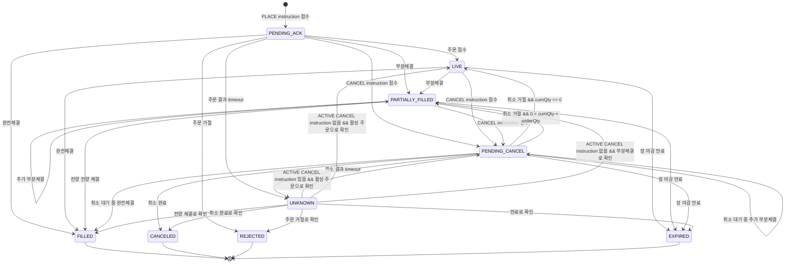

# 4. 도메인 모델과 상태 전이

## 4.1 목적

이 단계의 목적은 프로젝트에서 사용할 핵심 도메인 개념과 주문 상태 전이 규칙을 명확히 정의하는 것이다.

이 문서는 다음 질문에 답한다.

1. 이 시스템에서 “주문”은 무엇인가?
2. 주문 상태는 어떤 값으로 표현되는가?
3. 사용자의 주문 생성/취소 요청은 도메인에서 어떻게 표현되는가?
4. 외부 브로커 이벤트는 주문 상태에 어떻게 반영되는가?
5. 부분체결, 취소, 만료, `UNKNOWN`은 어떤 규칙으로 처리되는가?
6. 어떤 상태 전이는 허용되고, 어떤 상태 전이는 금지되는가?
7. 취소 요청 timeout 이후 reconciliation 결과에 따라 취소 의도를 어떻게 유지하거나 종료하는가?

이 단계에서는 DB 테이블, Kafka 토픽, API 스키마, 전문 필드 상세를 다루지 않는다.
해당 내용은 이후 설계 단계에서 다룬다.

---

## 4.2 도메인 경계

### 4.2.1 이 시스템이 다루는 도메인

본 시스템은 **해외주식 주문 상태 추적 도메인**을 다룬다.

핵심 관심사는 다음이다.

* 주문 생성
* 주문 생성 요청의 멱등성 처리
* 취소 요청의 멱등성 처리
* 외부 브로커 접수 여부 추적
* 주문 거절 처리
* 부분체결 처리
* 완전체결 처리
* 미체결 잔량 취소 처리
* DAY 주문 만료 처리
* 외부 응답 불확실성으로 인한 `UNKNOWN` 처리
* reconciliation을 통한 최종 상태 수렴

---

### 4.2.2 이 시스템이 다루지 않는 도메인

다음은 의도적으로 범위에서 제외한다.

* 계좌 원장
* 잔고 관리
* buying power
* position
* 평균 매입가
* 손익 계산
* 환전
* 정산
* 세금
* 수수료
* 실시간 시세
* 호가
* 실제 거래소 주문장 매칭

따라서 이 프로젝트의 주문 도메인은 **가격 평가나 계좌 정합성**이 아니라, **주문 상태와 수량 정합성**에 집중한다.

---

## 4.3 핵심 도메인 모델

## 4.3.1 Order

`Order`는 이 시스템의 핵심 aggregate다.

하나의 `Order`는 사용자의 `PLACE` instruction을 통해 생성된 하나의 해외주식 주문을 의미한다.
주문은 생성 이후 외부 브로커 이벤트, 사용자 취소 instruction, reconciliation 결과에 의해 상태가 변경된다.

중요한 점은 다음이다.

> `Order`는 주문 상태와 수량 정합성을 소유한다.
> 브로커 선택, 브로커 주문 식별자, 전문 송수신 상세는 `Order`의 도메인 속성이 아니다.

### 주요 속성

| 속성                     | 설명                   |
| ---------------------- | -------------------- |
| `orderId`              | 내부 주문 식별자            |
| `accountId`            | 사용자 또는 계좌 식별자        |
| `market`               | 시장. Phase 1에서는 `US`  |
| `symbol`               | 종목 코드                |
| `side`                 | `BUY` 또는 `SELL`      |
| `orderType`            | Phase 1에서는 `LIMIT`   |
| `tif`                  | Phase 1에서는 `DAY`     |
| `orderQty`             | 최초 주문 수량             |
| `limitPrice`           | 지정가                  |
| `status`               | 주문 현재 상태             |
| `cumQty`               | 누적 체결 수량             |
| `leavesQty`            | 남은 미체결 수량            |
| `reconciliationStatus` | reconciliation 진행 상태 |
| `createdAt`            | 주문 생성 시각             |
| `updatedAt`            | 마지막 변경 시각            |
| `terminalAt`           | 종결 시각                |

### 제외된 속성

다음 값은 `Order`의 핵심 도메인 속성으로 두지 않는다.

| 제외 속성                   | 제외 이유                                               |
| ----------------------- | --------------------------------------------------- |
| `clientOrderId`         | 주문 생성 instruction의 멱등성 키이지, 주문 aggregate 자체의 속성이 아님 |
| `clientCancelRequestId` | 취소 instruction의 멱등성 키이지, 주문 aggregate 자체의 속성이 아님    |
| `brokerCode`            | 브로커 연계 경계의 관심사                                      |
| `brokerOrderId`         | 브로커가 부여한 외부 식별자이며, Order Service의 상태 판단 기준이 아님      |
| `wireMessageId`         | 전문 단위 식별자이며, 브로커 통신 계층의 관심사                         |
| `avgFillPrice`          | Phase 1에서는 가격 평가/정산/포지션을 다루지 않음                     |
| `lastFillPrice`         | Phase 1에서는 체결 가격을 다루지 않음                            |

---

## 4.3.2 OrderInstruction

`OrderInstruction`은 사용자가 특정 주문과 관련해 시스템에 요청한 장기 실행 instruction을 의미한다.

Phase 1에서는 다음 두 종류의 instruction을 사용한다.

| Instruction | 의미                  |
| ----------- | ------------------- |
| `PLACE`     | 신규 주문 생성 요청         |
| `CANCEL`    | 기존 주문의 미체결 잔량 취소 요청 |

`OrderInstruction`은 이벤트 로그가 아니다.
이벤트는 이미 발생한 사실이고, instruction은 사용자가 요청한 의도와 그 처리 상태다.

예를 들어 `CANCEL` instruction은 단순히 “취소 요청 이벤트가 발생했다”가 아니라 다음을 포함한다.

* 사용자가 취소를 요청했다.
* 해당 취소 요청은 아직 진행 중일 수 있다.
* 브로커 응답이 timeout되면 자동 재시도 대상이 될 수 있다.
* 최종적으로 완료, 거절, 미적용, 실패 중 하나로 수렴한다.

---

### 주요 속성

| 속성                    | 설명                                          |
| --------------------- | ------------------------------------------- |
| `instructionId`       | 내부 instruction 식별자                          |
| `orderId`             | 대상 주문 ID. `PLACE`는 생성된 주문과 연결됨              |
| `accountId`           | 사용자 또는 계좌 식별자                               |
| `instructionType`     | `PLACE`, `CANCEL`                           |
| `clientInstructionId` | 클라이언트가 생성한 instruction 멱등성 키                |
| `status`              | instruction 처리 상태                           |
| `retryCount`          | 자동 재시도 횟수                                   |
| `requestPayload`      | 요청 당시의 주요 내용                                |
| `requestPayloadHash`  | 같은 멱등성 키로 다른 요청이 들어왔는지 확인하기 위한 payload hash |
| `resultCode`          | instruction 결과 코드                           |
| `resultMessage`       | instruction 결과 설명                           |
| `traceId`             | 요청 흐름 추적 ID                                 |
| `createdAt`           | instruction 생성 시각                           |
| `updatedAt`           | 마지막 변경 시각                                   |
| `resolvedAt`          | 결과 확정 시각                                    |

---

## 4.3.3 OrderInstructionStatus

`OrderInstruction`의 상태는 다음 값을 가진다.

| 상태            | 의미                                       |
| ------------- | ---------------------------------------- |
| `REQUESTED`   | instruction이 접수되었고 아직 최종 결과가 확정되지 않음     |
| `COMPLETED`   | instruction이 의도한 결과로 완료됨                 |
| `REJECTED`    | 외부 또는 내부 판단에 의해 instruction이 명시적으로 거절됨   |
| `NOT_APPLIED` | 주문이 다른 상태로 종결되어 instruction을 적용할 대상이 사라짐 |
| `FAILED`      | 재시도 한도 초과 또는 reconciliation 실패로 자동 처리 불가 |

상태 의미는 `instructionType`에 따라 다르게 해석한다.

### `PLACE` instruction 상태 의미

| 상태            | 의미                                            |
| ------------- | --------------------------------------------- |
| `REQUESTED`   | 주문 생성 instruction이 접수되었고 브로커 접수/거절 결과를 기다리는 중 |
| `COMPLETED`   | 브로커가 주문을 접수하여 주문이 활성화됨                        |
| `REJECTED`    | 브로커가 주문을 거절함                                  |
| `FAILED`      | 주문 생성 결과를 복구하지 못함                             |
| `NOT_APPLIED` | Phase 1에서는 일반적으로 사용하지 않음                      |

### `CANCEL` instruction 상태 의미

| 상태            | 의미                                       |
| ------------- | ---------------------------------------- |
| `REQUESTED`   | 취소 instruction이 접수되었고 아직 달성되지 않음         |
| `COMPLETED`   | 미체결 잔량 취소가 완료됨                           |
| `REJECTED`    | 브로커가 취소 요청을 명시적으로 거절함                    |
| `NOT_APPLIED` | 주문이 체결/만료 등으로 종결되어 취소할 잔량이 사라짐           |
| `FAILED`      | 재시도 한도 초과 또는 reconciliation 실패로 자동 처리 불가 |

`UNKNOWN`은 `OrderInstructionStatus`로 두지 않는다.
외부 상태 불확실성은 `Order.status = UNKNOWN`과 `Order.reconciliationStatus`로 표현한다.

---

## 4.3.4 OrderStatus

주문 상태는 다음 값을 가진다.

| 상태                 | 종결 여부 | 의미                                   |
| ------------------ | ----: | ------------------------------------ |
| `PENDING_ACK`      |     N | 내부 주문은 생성되었지만 브로커 접수/거절이 확정되지 않음     |
| `LIVE`             |     N | 브로커가 주문을 접수했고 아직 체결은 없음              |
| `PARTIALLY_FILLED` |     N | 일부 수량이 체결되었고 잔량이 남아 있음               |
| `PENDING_CANCEL`   |     N | 취소 instruction이 접수되었고 취소 결과가 확정되지 않음 |
| `UNKNOWN`          |     N | 외부 응답 유실/timeout 등으로 현재 외부 상태가 불확실함  |
| `FILLED`           |     Y | 전체 수량이 체결되어 주문이 종결됨                  |
| `CANCELED`         |     Y | 미체결 잔량이 취소되어 주문이 종결됨                 |
| `REJECTED`         |     Y | 주문이 거절되어 종결됨                         |
| `EXPIRED`          |     Y | DAY 주문의 미체결 잔량이 장 마감으로 만료되어 종결됨      |

---

## 4.3.5 ReconciliationStatus

`reconciliationStatus`는 주문의 비즈니스 상태가 아니라, 불확실한 주문 상태를 수습하는 복구 작업의 진행 상태다.

| 상태         | 의미                        |
| ---------- | ------------------------- |
| `NONE`     | reconciliation 대상이 아님     |
| `PENDING`  | reconciliation 필요         |
| `RUNNING`  | reconciliation 수행 중       |
| `RESOLVED` | reconciliation으로 상태 수렴 완료 |
| `FAILED`   | reconciliation 실패         |

중요한 원칙은 다음이다.

> `RECONCILING`을 주문 상태로 두지 않는다.
> Reconciliation은 주문의 비즈니스 상태가 아니라 복구 작업 상태이므로 `reconciliationStatus`로 분리한다.

---

## 4.3.6 BrokerEvent

`BrokerEvent`는 Broker Gateway가 외부 브로커 전문을 해석해 Order Service에 전달하는 canonical event다.

Order Service는 브로커 전문 포맷, 브로커 코드, 브로커 주문 ID, fixed-length body, wire protocol을 직접 알지 않는다.
Order Service는 `BrokerEvent`를 주문 상태에 적용할 수 있는 도메인 사건으로만 취급한다.

### 이벤트 종류

| 이벤트                           | 의미                           |
| ----------------------------- | ---------------------------- |
| `BrokerOrderAcknowledged`     | 브로커가 주문을 접수함                 |
| `BrokerOrderRejected`         | 브로커가 주문을 거절함                 |
| `BrokerOrderPartiallyFilled`  | 일부 수량이 체결됨                   |
| `BrokerOrderFilled`           | 전체 수량이 체결됨                   |
| `BrokerCancelAcknowledged`    | 브로커가 취소를 완료함                 |
| `BrokerCancelRejected`        | 브로커가 취소를 거절함                 |
| `BrokerOrderExpired`          | DAY 주문 미체결 잔량이 만료됨           |
| `BrokerOrderStatusSnapshot`   | 상태조회 결과 수신                   |
| `BrokerCommandOutcomeUnknown` | command 결과가 timeout/유실로 불확실함 |

### 중복 방지 기준

BrokerEvent의 중복 판단은 `brokerEventDedupKey`를 기준으로 한다.

`brokerEventDedupKey`는 Broker Gateway가 생성한 opaque semantic key다.
Order Service는 이 값의 내부 구조를 해석하지 않는다.

원칙은 다음이다.

> 같은 `brokerEventDedupKey`는 같은 외부 브로커 사건을 의미한다.
> Order Service는 같은 key를 가진 BrokerEvent를 주문 상태에 두 번 반영하지 않는다.

같은 `brokerEventDedupKey`인데 payload가 다르면 브로커 오류 또는 프로토콜 위반으로 본다.
이 경우 이벤트를 상태에 반영하지 않고 운영 이력에 남기며, 필요 시 reconciliation 대상으로 올린다.

---

## 4.3.7 BrokerOrderReference

`BrokerOrderReference`는 Order 도메인의 핵심 모델로 두지 않는다.

브로커 식별자, 브로커 주문 ID, 전문 송수신 상세는 Broker Gateway의 관심사다.
Order Service는 브로커 관련 값을 직접 사용해 주문 상태를 판단하지 않는다.

따라서 이 장에서는 `BrokerOrderReference`를 Order 도메인 모델로 정의하지 않는다.

다만 운영 추적과 브로커 상태조회 관점에서는 브로커 측 주문 식별자가 필요할 수 있다.
그 정보는 Broker Gateway 경계에서 관리한다.

---

## 4.4 수량 모델과 불변식

이 프로젝트는 체결 가격을 다루지 않고 수량 정합성에 집중한다.

### 4.4.1 핵심 수량

| 속성            | 의미        |
| ------------- | --------- |
| `orderQty`    | 최초 주문 수량  |
| `cumQty`      | 누적 체결 수량  |
| `leavesQty`   | 남은 미체결 수량 |
| `lastFillQty` | 이번 체결 수량  |

---

### 4.4.2 수량 불변식

모든 주문은 다음 불변식을 만족해야 한다.

```text
0 <= cumQty <= orderQty
0 <= leavesQty <= orderQty
cumQty + leavesQty <= orderQty
```

일반적인 활성 주문에서는 다음이 성립한다.

```text
cumQty + leavesQty = orderQty
```

종결 상태인 `CANCELED`, `EXPIRED`, `REJECTED`에서는 `leavesQty = 0`이 될 수 있으므로 다음처럼 해석한다.

```text
orderQty = cumQty + canceledQty + expiredQty + rejectedQty
```

Phase 1에서는 `canceledQty`, `expiredQty`, `rejectedQty`를 별도 속성으로 관리하지 않는다.
상태와 `cumQty`, `leavesQty` 조합으로 의미를 해석한다.

---

### 4.4.3 상태별 수량 규칙

| 상태                 | 수량 규칙                                                    |
| ------------------ | -------------------------------------------------------- |
| `PENDING_ACK`      | `cumQty = 0`, `leavesQty = orderQty`                     |
| `LIVE`             | `cumQty = 0`, `leavesQty = orderQty`                     |
| `PARTIALLY_FILLED` | `0 < cumQty < orderQty`, `leavesQty = orderQty - cumQty` |
| `PENDING_CANCEL`   | `leavesQty > 0`                                          |
| `UNKNOWN`          | 마지막으로 확정된 수량을 유지                                         |
| `FILLED`           | `cumQty = orderQty`, `leavesQty = 0`                     |
| `CANCELED`         | `cumQty < orderQty`, `leavesQty = 0`                     |
| `REJECTED`         | `cumQty = 0`, `leavesQty = 0`                            |
| `EXPIRED`          | `cumQty < orderQty`, `leavesQty = 0`                     |

주의할 점:

* `CANCELED`는 전체 주문이 없던 일이 되었다는 뜻이 아니다.
* `CANCELED` 상태에서 `cumQty > 0`이면 **부분체결 후 잔량 취소**를 의미한다.
* `EXPIRED` 상태에서 `cumQty > 0`이면 **부분체결 후 잔량 만료**를 의미한다.
* `UNKNOWN`은 실패가 아니라, 현재 외부 상태가 불확실하다는 뜻이다.

---

# 4.5 주문 상태 전이도

## 4.5.1 상태 전이 다이어그램



---

## 4.5.2 상태 전이 표

| 현재 상태              | 이벤트                                                 | 다음 상태              | 설명                              |
| ------------------ | --------------------------------------------------- | ------------------ | ------------------------------- |
| `PENDING_ACK`      | `BrokerOrderAcknowledged`                           | `LIVE`             | 브로커 주문 접수                       |
| `PENDING_ACK`      | `BrokerOrderRejected`                               | `REJECTED`         | 브로커 주문 거절                       |
| `PENDING_ACK`      | `BrokerOrderPartiallyFilled`                        | `PARTIALLY_FILLED` | ACK보다 체결 이벤트가 먼저 온 경우 허용        |
| `PENDING_ACK`      | `BrokerOrderFilled`                                 | `FILLED`           | ACK보다 완전체결 이벤트가 먼저 온 경우 허용      |
| `PENDING_ACK`      | `CancelInstructionRequested`                        | `PENDING_CANCEL`   | 접수 확인 전 취소 instruction 접수       |
| `PENDING_ACK`      | `SubmitOutcomeTimeout`                              | `UNKNOWN`          | 주문 전송 결과 불확실                    |
| `LIVE`             | `BrokerOrderPartiallyFilled`                        | `PARTIALLY_FILLED` | 일부 체결                           |
| `LIVE`             | `BrokerOrderFilled`                                 | `FILLED`           | 전량 체결                           |
| `LIVE`             | `CancelInstructionRequested`                        | `PENDING_CANCEL`   | 잔량 취소 instruction 접수            |
| `LIVE`             | `BrokerOrderExpired`                                | `EXPIRED`          | 장 마감으로 미체결 잔량 만료                |
| `PARTIALLY_FILLED` | `BrokerOrderPartiallyFilled`                        | `PARTIALLY_FILLED` | 추가 부분체결                         |
| `PARTIALLY_FILLED` | `BrokerOrderFilled`                                 | `FILLED`           | 잔량 전량 체결                        |
| `PARTIALLY_FILLED` | `CancelInstructionRequested`                        | `PENDING_CANCEL`   | 미체결 잔량 취소 instruction 접수        |
| `PARTIALLY_FILLED` | `BrokerOrderExpired`                                | `EXPIRED`          | 미체결 잔량 만료                       |
| `PENDING_CANCEL`   | `BrokerOrderPartiallyFilled`                        | `PENDING_CANCEL`   | 취소 대기 중 추가 부분체결                 |
| `PENDING_CANCEL`   | `BrokerOrderFilled`                                 | `FILLED`           | 취소 대기 중 전량 체결                   |
| `PENDING_CANCEL`   | `BrokerCancelAcknowledged`                          | `CANCELED`         | 미체결 잔량 취소 완료                    |
| `PENDING_CANCEL`   | `BrokerCancelRejected`, `cumQty = 0`                | `LIVE`             | 취소 거절, 체결 없음                    |
| `PENDING_CANCEL`   | `BrokerCancelRejected`, `0 < cumQty < orderQty`     | `PARTIALLY_FILLED` | 취소 거절, 부분체결 상태 유지               |
| `PENDING_CANCEL`   | `BrokerOrderExpired`                                | `EXPIRED`          | 취소 대기 중 장 마감 만료                 |
| `PENDING_CANCEL`   | `CancelOutcomeTimeout`                              | `UNKNOWN`          | 취소 결과 불확실                       |
| `UNKNOWN`          | `Snapshot=ACCEPTED`, active `CANCEL` instruction 있음 | `PENDING_CANCEL`   | 취소 의도 유지, cancel command 자동 재발행 |
| `UNKNOWN`          | `Snapshot=PARTIAL`, active `CANCEL` instruction 있음  | `PENDING_CANCEL`   | 취소 의도 유지, cancel command 자동 재발행 |
| `UNKNOWN`          | `Snapshot=ACCEPTED`, active `CANCEL` instruction 없음 | `LIVE`             | 상태조회 결과 활성 주문                   |
| `UNKNOWN`          | `Snapshot=PARTIAL`, active `CANCEL` instruction 없음  | `PARTIALLY_FILLED` | 상태조회 결과 부분체결                    |
| `UNKNOWN`          | `Snapshot=FILLED`                                   | `FILLED`           | 상태조회 결과 전량 체결                   |
| `UNKNOWN`          | `Snapshot=CANCELED`                                 | `CANCELED`         | 상태조회 결과 취소 완료                   |
| `UNKNOWN`          | `Snapshot=REJECTED`                                 | `REJECTED`         | 상태조회 결과 주문 거절                   |
| `UNKNOWN`          | `Snapshot=EXPIRED`                                  | `EXPIRED`          | 상태조회 결과 주문 만료                   |

---

# 4.6 주요 도메인 규칙

## DR-001. 주문 상태 변경 주체

주문 상태는 Order Service만 변경한다.

Broker Gateway와 Recovery Service는 주문 상태를 직접 변경하지 않는다.
이들은 canonical broker event 또는 reconciliation result를 전달하고, Order Service가 상태머신을 통해 최종 상태를 반영한다.

---

## DR-002. 주문 생성 instruction 멱등성

동일 `accountId + clientOrderId`로 동일 payload가 다시 들어오면 기존 주문 결과를 반환한다.

도메인 내부적으로는 이를 다음처럼 해석한다.

```text
instructionType = PLACE
clientInstructionId = clientOrderId
```

동일 `accountId + clientOrderId`지만 payload가 다르면 충돌로 처리한다.
이 경우 새로운 주문을 생성하지 않는다.

---

## DR-003. 취소 instruction 멱등성

동일 주문에 대해 동일 `clientCancelRequestId`로 동일 payload가 다시 들어오면 기존 취소 instruction 결과를 반환한다.

도메인 내부적으로는 이를 다음처럼 해석한다.

```text
instructionType = CANCEL
clientInstructionId = clientCancelRequestId
```

다른 `clientCancelRequestId`로 새 취소 요청이 들어왔더라도, 이미 active `CANCEL` instruction이 있으면 충돌로 처리한다.
즉, 하나의 주문에는 동시에 하나의 active `CANCEL` instruction만 허용한다.

---

## DR-004. Instruction과 Event의 구분

`OrderInstruction`은 사용자의 의도와 처리 상태를 표현한다.

예:

* 주문을 생성하고 싶다.
* 주문의 잔량을 취소하고 싶다.
* 해당 instruction이 아직 진행 중이다.
* 해당 instruction이 완료되었거나 실패했다.

`OrderEvent`는 이미 발생한 사실의 이력이다.

예:

* 주문이 생성되었다.
* 주문 상태가 변경되었다.
* 부분체결이 반영되었다.
* 취소 instruction이 완료되었다.

따라서 instruction과 event는 서로 대체 관계가 아니다.
instruction은 현재 처리 상태를 갖고, event는 변경 이력을 남긴다.

---

## DR-005. 브로커 이벤트 중복 처리

동일 `brokerEventDedupKey`를 가진 broker event는 한 번만 주문 상태에 반영한다.

`brokerEventDedupKey`는 Broker Gateway가 생성한 opaque key다.
Order Service는 이 값을 파싱하지 않는다.

같은 `brokerEventDedupKey`가 다시 들어오면 중복 이벤트로 보고 주문 상태에 재반영하지 않는다.

같은 `brokerEventDedupKey`인데 payload가 다르면 브로커 오류 또는 프로토콜 위반으로 간주한다.
이 경우 이벤트를 상태에 반영하지 않고, 운영 이력에 남기며, 필요 시 reconciliation 대상으로 올린다.

---

## DR-006. ACK보다 먼저 도착한 체결 이벤트 허용

브로커 이벤트는 항상 정상 순서로 도착한다고 가정하지 않는다.

따라서 `PENDING_ACK` 상태에서도 부분체결과 완전체결 이벤트를 허용한다.

이 경우 시스템은 브로커가 주문을 사실상 수락한 것으로 간주하고, 수량 정보에 따라 `PARTIALLY_FILLED` 또는 `FILLED`로 전이한다.

---

## DR-007. 부분체결 후 취소

부분체결 이후 취소 instruction은 이미 체결된 수량을 취소하지 않는다.

취소 instruction은 미체결 잔량에 대해서만 적용된다.

예시:

```text
orderQty = 100
cumQty = 40
leavesQty = 60

CANCEL instruction
BrokerCancelAcknowledged

status = CANCELED
cumQty = 40
leavesQty = 0
```

---

## DR-008. 취소 대기 중 추가 체결

`PENDING_CANCEL` 상태에서도 추가 체결 이벤트가 도착할 수 있다.

* 추가 부분체결이면 `PENDING_CANCEL` 상태를 유지하고 `cumQty`, `leavesQty`를 갱신한다.
* 전량 체결이면 `FILLED`로 종결한다.
* 이후 늦게 도착한 취소 완료/거절 이벤트는 상태를 오염시키면 안 된다.

---

## DR-009. 취소 의도의 유지

`CANCEL` instruction은 사용자의 잔량 취소 의도를 의미한다.

취소 결과가 timeout으로 불확실해진 뒤 reconciliation 결과가 `ACCEPTED` 또는 `PARTIAL`인 경우, 시스템은 사용자의 취소 의도가 아직 충족되지 않은 것으로 본다.

이 경우:

* active `CANCEL` instruction의 상태는 `REQUESTED`로 유지한다.
* `Order.status = PENDING_CANCEL`로 전환한다.
* 새로운 cancel command를 자동 발행한다.
* 사용자가 취소 요청을 다시 보낼 필요는 없다.

자동 취소 재시도는 무한 반복하지 않는다.
동일 `CANCEL` instruction에 대해 재시도 횟수를 제한하고, 한도를 초과하면 다음처럼 처리한다.

* `Order.status = UNKNOWN`
* `Order.reconciliationStatus = FAILED`
* `CANCEL` instruction 상태 = `FAILED`
* 운영 추적 대상으로 남김

---

## DR-010. DAY 주문 만료

TIF가 `DAY`인 주문은 장 마감 시 미체결 잔량이 만료될 수 있다.

`EXPIRED`는 미체결 잔량이 더 이상 살아 있지 않음을 의미한다.

가능한 전이는 다음과 같다.

* `LIVE -> EXPIRED`
* `PARTIALLY_FILLED -> EXPIRED`
* `PENDING_CANCEL -> EXPIRED`

`EXPIRED` 상태에서는 `leavesQty = 0`이어야 한다.

---

## DR-011. UNKNOWN은 실패가 아니다

`UNKNOWN`은 주문 실패가 아니라 외부 상태 불확실성을 의미한다.

다음 상황에서 `UNKNOWN`으로 전이될 수 있다.

* 주문 전송 후 ACK timeout
* 취소 요청 후 응답 timeout
* 브로커 연결 문제로 결과 판단 불가
* 동일 broker event dedup key에 다른 payload 수신
* 상태 이벤트와 현재 내부 상태가 충돌하여 자동 판정이 어려운 경우

`UNKNOWN` 주문은 reconciliation 대상이다.

---

## DR-012. UNKNOWN 상태의 사용자 조작 제한

`UNKNOWN` 상태에서는 사용자가 추가 취소 요청을 할 수 없다.

이유는 현재 외부 상태가 불확실한 상황에서 추가 command를 보내면 중복 취소, 잘못된 상태 전이, 불필요한 경합이 발생할 수 있기 때문이다.

먼저 reconciliation을 통해 상태를 수렴시킨 뒤 사용자 조작을 허용한다.

단, 이미 active `CANCEL` instruction이 있고 reconciliation 결과 주문이 여전히 활성 상태라면, 시스템이 기존 취소 의도를 유지하고 자동으로 cancel command를 재발행한다.

---

## DR-013. 종결 상태 불변성

다음 상태는 종결 상태다.

* `FILLED`
* `CANCELED`
* `REJECTED`
* `EXPIRED`

종결 상태 이후 도착한 이벤트는 기본적으로 주문 상태를 변경하지 않는다.

단, 종결 상태와 충돌하는 이벤트가 도착하면 다음 중 하나로 처리한다.

* 중복 이벤트로 무시
* 운영 이력에 기록
* reconciliation 후보로 등록

---

# 4.7 Reconciliation 상태 수렴 규칙

`UNKNOWN` 주문은 브로커 상태조회 결과에 따라 최종 상태로 수렴한다.

## 4.7.1 상태조회 결과 매핑

| Broker Snapshot | active `CANCEL` instruction | Order 처리           | Instruction 처리                                 | 추가 동작                 |
| --------------- | --------------------------: | ------------------ | ---------------------------------------------- | --------------------- |
| `ACCEPTED`      |                           N | `LIVE`             | 해당 없음                                          | 없음                    |
| `ACCEPTED`      |                           Y | `PENDING_CANCEL`   | `REQUESTED` 유지                                 | cancel command 자동 재발행 |
| `PARTIAL`       |                           N | `PARTIALLY_FILLED` | 해당 없음                                          | 없음                    |
| `PARTIAL`       |                           Y | `PENDING_CANCEL`   | `REQUESTED` 유지                                 | cancel command 자동 재발행 |
| `FILLED`        |                         Y/N | `FILLED`           | active `CANCEL`이 있으면 `NOT_APPLIED`             | 없음                    |
| `CANCELED`      |                         Y/N | `CANCELED`         | active `CANCEL`이 있으면 `COMPLETED`               | 없음                    |
| `REJECTED`      |                         Y/N | `REJECTED`         | active `CANCEL`이 있으면 `NOT_APPLIED` 또는 `FAILED` | 사유 기록                 |
| `EXPIRED`       |                         Y/N | `EXPIRED`          | active `CANCEL`이 있으면 `NOT_APPLIED`             | 없음                    |
| `NOT_FOUND`     |                         Y/N | `UNKNOWN` 유지       | active `CANCEL`이 있으면 `REQUESTED` 또는 `FAILED`   | 재시도 정책에 따름            |

---

## 4.7.2 `NOT_FOUND` 처리

브로커 상태조회 결과가 `NOT_FOUND`인 경우는 애매하다.

가능한 의미는 두 가지다.

1. 실제로 브로커에 주문이 도달하지 않았다.
2. 브로커 조회 시점 또는 식별자 문제로 일시적으로 찾지 못했다.

따라서 `NOT_FOUND`를 곧바로 `REJECTED` 또는 실패로 처리하면 위험하다.

Phase 1에서는 `NOT_FOUND`를 자동 종결하지 않는다.

기본 처리 방침은 다음과 같다.

* `Order.status = UNKNOWN` 유지
* `Order.reconciliationStatus = FAILED`
* active `CANCEL` instruction이 있으면 `REQUESTED` 또는 `FAILED`로 정리
* 실패 사유 기록
* 운영 추적 대상으로 남김

---

# 4.8 확정 사항 요약

| 항목                            | 결정                                                            |
| ----------------------------- | ------------------------------------------------------------- |
| 핵심 aggregate                  | `Order`                                                       |
| 주문 상태 변경 주체                   | Order Service                                                 |
| 주문 생성 요청                      | `PLACE` instruction으로 모델링                                     |
| 취소 요청                         | `CANCEL` instruction으로 모델링                                    |
| instruction 상태                | `REQUESTED`, `COMPLETED`, `REJECTED`, `NOT_APPLIED`, `FAILED` |
| reconciliation 상태             | `Order.reconciliationStatus`로 분리                              |
| 브로커 식별자                       | Order 도메인 모델에 포함하지 않음                                         |
| BrokerEvent                   | Broker Gateway가 정규화한 canonical event로 취급                      |
| 중복 broker event 기준            | Gateway가 부여한 opaque `brokerEventDedupKey`                     |
| 부분체결 후 취소                     | 체결분 확정 + 미체결 잔량 취소                                            |
| 취소 timeout 후 활성 상태 확인         | 사용자가 다시 요청하지 않고 시스템이 cancel command 자동 재발행                    |
| ACK 전 체결 이벤트                  | 허용                                                            |
| `PENDING_CANCEL` 중 추가 체결      | 허용                                                            |
| DAY 만료                        | `LIVE`, `PARTIALLY_FILLED`, `PENDING_CANCEL`에서 `EXPIRED` 가능   |
| `NOT_FOUND` reconciliation 결과 | 자동 종결하지 않고 `UNKNOWN + FAILED`로 운영 추적                          |
