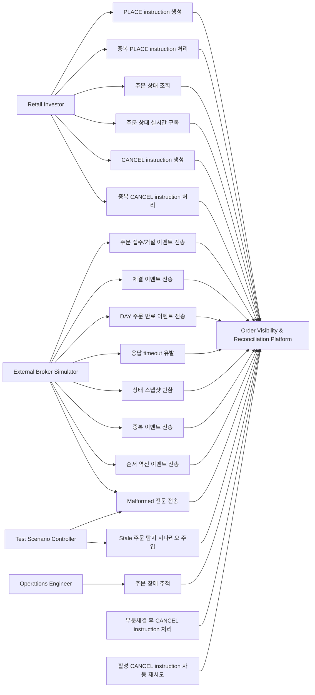

# 5. 주요 유스케이스

## 5.1 목적

이 단계의 목적은 앞서 정의한 문제, 요구사항, 도메인 모델을 실제 사용자·외부 브로커·운영자 관점의 주요 시나리오로 정리하는 것이다.

이 문서는 다음을 명확히 한다.

1. 사용자는 어떤 흐름으로 주문을 생성, 조회, 취소하는가?
2. 사용자의 주문 생성/취소 요청은 어떤 instruction으로 처리되는가?
3. 외부 브로커 이벤트는 어떤 흐름으로 주문 상태에 반영되는가?
4. 부분체결, 취소 경합, 만료, `UNKNOWN`, reconciliation은 어떤 시나리오로 검증되는가?
5. 식별 가능한/불가능한 malformed 전문은 어떻게 처리되는가?
6. 이벤트 유실로 non-terminal 상태에 남은 주문은 어떻게 탐지하고 복구하는가?
7. 운영자는 장애 상황에서 무엇을 추적할 수 있어야 하는가?

이 단계에서는 DB 테이블, Kafka 토픽, API 상세 스키마, 전문 필드 상세는 다루지 않는다.

---

## 5.2 Actor 목록

| Actor                       | 설명                                                                  |
| --------------------------- | ------------------------------------------------------------------- |
| `Retail Investor`           | 주문 생성, 주문 조회, 주문 취소, 실시간 상태 확인을 수행하는 사용자                            |
| `External Broker Simulator` | 주문 접수/거절/체결/취소/만료/상태조회 이벤트를 발생시키는 외부 브로커 대역                         |
| `Operations Engineer`       | 주문 상태 이상, 브로커 상호작용, reconciliation 결과를 추적하는 운영자 또는 서버 개발자           |
| `Test Scenario Controller`  | Broker Simulator에 지연, 유실, 중복, 순서 역전, malformed 전문 시나리오를 주입하는 테스트 주체 |

---

## 5.3 유스케이스 개요



---

## 5.4 주요 유스케이스 목록

| ID       | 유스케이스                                    | Primary Actor                                | 핵심 목적                                                       |
| -------- | ---------------------------------------- | -------------------------------------------- | ----------------------------------------------------------- |
| `UC-001` | 신규 주문 생성                                 | Retail Investor                              | 사용자의 `PLACE` instruction을 접수하고 내부 주문을 생성한다                  |
| `UC-002` | 중복 주문 생성 요청 처리                           | Retail Investor                              | 동일 `clientOrderId` 기반 `PLACE` instruction을 멱등하게 처리한다        |
| `UC-003` | 주문 상태 조회                                 | Retail Investor                              | 현재 주문 상태와 체결/잔량 정보를 조회한다                                    |
| `UC-004` | 주문 상태 실시간 구독                             | Retail Investor                              | SSE로 주문 상태 변경을 실시간 확인한다                                     |
| `UC-005` | 브로커 주문 접수/거절 반영                          | External Broker Simulator                    | 브로커 접수/거절 이벤트를 내부 주문 상태에 반영한다                               |
| `UC-006` | 부분체결/완전체결 반영                             | External Broker Simulator                    | 체결 이벤트를 수량 정합성에 맞게 반영한다                                     |
| `UC-007` | 주문 취소 요청                                 | Retail Investor                              | 미체결 잔량에 대한 `CANCEL` instruction을 생성한다                       |
| `UC-008` | 중복 취소 요청 처리                              | Retail Investor                              | 동일하거나 충돌하는 `CANCEL` instruction을 안전하게 처리한다                  |
| `UC-009` | 부분체결 후 취소 처리                             | Retail Investor / External Broker Simulator  | 체결분은 확정하고 미체결 잔량 취소를 처리한다                                   |
| `UC-010` | DAY 주문 만료 처리                             | External Broker Simulator                    | 장 마감 시 미체결 잔량을 `EXPIRED`로 수렴시킨다                             |
| `UC-011` | 응답 timeout 후 UNKNOWN 처리                  | External Broker Simulator                    | 응답 불확실성을 `UNKNOWN`으로 격리한다                                   |
| `UC-012` | Reconciliation으로 상태 수렴                   | Recovery Service / External Broker Simulator | 상태조회 결과로 `UNKNOWN` 주문을 복구한다                                 |
| `UC-013` | 취소 의도 유지 후 자동 재시도                        | Recovery Service / Order Service             | 취소 timeout 후 활성 주문이면 기존 `CANCEL` instruction을 유지하고 자동 재시도한다 |
| `UC-014` | 중복 브로커 이벤트 처리                            | External Broker Simulator                    | 중복 이벤트가 주문 상태를 오염시키지 않게 한다                                  |
| `UC-015` | 순서 역전 브로커 이벤트 처리                         | External Broker Simulator                    | out-of-order 이벤트에도 상태가 수렴하게 한다                              |
| `UC-016` | Malformed 전문 처리                          | External Broker Simulator                    | 형식 오류 전문을 상태 변경과 분리하고 필요 시 복구 대상으로 만든다                      |
| `UC-017` | Stale Order Detection and Reconciliation | Recovery Service                             | 이벤트 유실로 non-terminal에 남은 주문을 탐지하고 상태조회로 수렴시킨다               |
| `UC-018` | 주문 장애 추적                                 | Operations Engineer                          | 주문 상태 변화, 브로커 상호작용, reconciliation 이력을 추적한다                 |

---

# 5.5 상세 유스케이스

## UC-001. 신규 주문 생성

### Primary Actor

`Retail Investor`

### 목적

사용자가 해외주식 지정가 주문을 생성한다.

도메인 관점에서 주문 생성은 `PLACE` instruction으로 표현된다.
`PLACE` instruction이 유효하게 접수되면 시스템은 내부 주문 aggregate를 생성하고, 주문 상태를 `PENDING_ACK`로 시작한다.

### 사전 조건

* 시장 상태는 `OPEN`이다.
* 주문 타입은 `LIMIT`이다.
* TIF는 `DAY`로 고정된다.
* 사용자는 `clientOrderId`를 포함해 주문 생성 요청을 보낸다.

### 기본 흐름

1. 사용자가 종목, 매수/매도, 수량, 지정가를 입력한다.
2. 시스템은 주문 생성 요청의 유효성을 검증한다.
3. 시스템은 `accountId + clientOrderId` 기준으로 기존 `PLACE` instruction이 있는지 확인한다.
4. 중복이 아니면 `PLACE` instruction을 생성한다.
5. 시스템은 내부 `orderId`를 생성하고 주문 aggregate를 만든다.
6. 주문 상태를 `PENDING_ACK`로 시작한다.
7. 외부 브로커 전송 요청을 생성한다.
8. 사용자에게 주문 생성 접수 결과를 반환한다.

### 사후 조건

* `PLACE` instruction은 `REQUESTED` 상태다.
* 주문은 `PENDING_ACK` 상태다.
* `cumQty = 0`, `leavesQty = orderQty`다.
* 브로커 전송 대상 command가 생성된다.

### 예외 흐름

| 조건                              | 처리               |
| ------------------------------- | ---------------- |
| 주문 수량이 0 이하                     | 요청 거절            |
| 지정가가 0 이하                       | 요청 거절            |
| 지원하지 않는 주문 타입                   | 요청 거절            |
| 동일 `clientOrderId` + 동일 payload | 기존 주문 생성 결과 반환   |
| 동일 `clientOrderId` + 다른 payload | 충돌 처리            |
| 시장 상태가 `CLOSED`                 | Phase 1에서는 주문 거절 |

---

## UC-002. 중복 주문 생성 요청 처리

### Primary Actor

`Retail Investor`

### 목적

사용자 재시도 또는 네트워크 재전송으로 동일 주문 생성 요청이 여러 번 들어와도 주문이 중복 생성되지 않게 한다.

### 사전 조건

* 동일 `accountId + clientOrderId`로 이미 `PLACE` instruction이 접수되어 있다.

### 기본 흐름

1. 사용자가 동일 `clientOrderId`로 주문 생성 요청을 다시 보낸다.
2. 시스템은 기존 `PLACE` instruction을 조회한다.
3. 기존 요청 payload와 재요청 payload를 비교한다.
4. payload가 동일하면 기존 주문 생성 결과를 반환한다.

### 사후 조건

* 새로운 `PLACE` instruction은 생성되지 않는다.
* 새로운 `orderId`는 생성되지 않는다.
* 외부 브로커로 중복 주문 전송이 발생하지 않는다.

### 예외 흐름

| 조건                               | 처리               |
| -------------------------------- | ---------------- |
| 동일 `clientOrderId`지만 payload가 다름 | 충돌로 처리           |
| 기존 주문이 terminal 상태               | 기존 주문 상태를 그대로 반환 |

---

## UC-003. 주문 상태 조회

### Primary Actor

`Retail Investor`

### 목적

사용자가 주문 현재 상태를 조회한다.

사용자-facing 조회는 주문 상태와 수량 정합성에 집중한다.
브로커 코드, 브로커 주문 ID, 전문 송수신 상세는 일반 사용자 관심사가 아니므로 기본 조회 정보에 포함하지 않는다.

### 기본 흐름

1. 사용자가 주문 상세 또는 주문 목록을 요청한다.
2. 시스템은 사용자의 접근 권한 또는 계좌 범위를 확인한다.
3. 시스템은 주문 현재 상태를 조회한다.
4. 주문 상태, 누적 체결 수량, 잔여 수량, reconciliation 상태를 반환한다.
5. 필요하면 현재 활성 `CANCEL` instruction 여부를 함께 표시한다.

### 조회 정보

* `orderId`
* `symbol`
* `side`
* `orderQty`
* `limitPrice`
* `status`
* `cumQty`
* `leavesQty`
* `reconciliationStatus`
* `createdAt`
* `updatedAt`
* `terminalAt`
* 취소 진행 여부

### 예외 흐름

| 조건              | 처리               |
| --------------- | ---------------- |
| 존재하지 않는 주문      | Not Found        |
| 다른 사용자의 주문      | 접근 거부            |
| `UNKNOWN` 상태 주문 | 현재 확인 중임을 명확히 표시 |

---

## UC-004. 주문 상태 실시간 구독

### Primary Actor

`Retail Investor`

### 목적

사용자가 주문 상태 변경을 SSE로 실시간 확인한다.

### 기본 흐름

1. 사용자가 주문 상태 스트림에 연결한다.
2. 시스템은 사용자 또는 계좌 기준으로 구독 범위를 설정한다.
3. 주문 상태가 변경되면 시스템은 SSE 이벤트를 전송한다.
4. 사용자는 주문 목록 또는 상세 화면에서 변경된 상태를 확인한다.

### 전송 대상 이벤트

* `LIVE`
* `PARTIALLY_FILLED`
* `FILLED`
* `PENDING_CANCEL`
* `CANCELED`
* `REJECTED`
* `EXPIRED`
* `UNKNOWN`
* reconciliation resolved

### 예외 흐름

| 조건         | 처리                       |
| ---------- | ------------------------ |
| SSE 연결 끊김  | 사용자는 조회 API로 최종 상태 확인 가능 |
| 이벤트 전송 실패  | 주문 상태는 오염되지 않음           |
| 늦게 연결한 사용자 | 최근 상태는 조회 API로 확인        |

---

## UC-005. 브로커 주문 접수/거절 반영

### Primary Actor

`External Broker Simulator`

### 목적

브로커가 주문 접수 또는 거절 이벤트를 보내면 시스템이 주문 상태에 반영한다.

Order Service는 브로커 전문 포맷이나 브로커 식별자를 직접 해석하지 않는다.
Broker Gateway가 브로커 전문을 canonical broker event로 변환하고, Order Service는 이를 주문 상태머신에 적용한다.

### 기본 흐름: 주문 접수

1. Broker Simulator가 주문 접수 전문을 보낸다.
2. Broker Gateway가 전문을 파싱한다.
3. Broker Gateway가 canonical `BrokerOrderAcknowledged` event로 변환한다.
4. Order Service가 이벤트를 적용한다.
5. 주문 상태가 `LIVE`로 전환된다.
6. `PLACE` instruction은 `COMPLETED`로 수렴한다.
7. 사용자에게 상태 변경이 전달된다.

### 기본 흐름: 주문 거절

1. Broker Simulator가 주문 거절 전문을 보낸다.
2. Broker Gateway가 전문을 파싱한다.
3. Broker Gateway가 canonical `BrokerOrderRejected` event로 변환한다.
4. Order Service가 주문을 `REJECTED`로 종결한다.
5. `PLACE` instruction은 `REJECTED`로 수렴한다.
6. 거절 사유를 이력에 기록한다.
7. 사용자에게 상태 변경이 전달된다.

### 예외 흐름

| 조건                                    | 처리                              |
| ------------------------------------- | ------------------------------- |
| 이미 처리한 `brokerEventDedupKey`          | 중복 이벤트로 무시                      |
| 동일 `brokerEventDedupKey` + 다른 payload | 프로토콜 위반으로 기록, reconciliation 후보 |
| ACK보다 체결 이벤트가 먼저 도착                   | 체결 이벤트를 우선 반영 가능                |

---

## UC-006. 부분체결/완전체결 반영

### Primary Actor

`External Broker Simulator`

### 목적

브로커가 체결 이벤트를 보내면 주문의 체결 수량과 상태를 반영한다.

### 기본 흐름: 부분체결

1. Broker Simulator가 부분체결 전문을 보낸다.
2. Broker Gateway가 전문을 canonical `BrokerOrderPartiallyFilled` event로 변환한다.
3. Order Service가 `lastFillQty`, `cumQty`, `leavesQty`를 검증한다.
4. 주문 상태를 `PARTIALLY_FILLED`로 전환한다.
5. 사용자에게 상태 변경을 전달한다.

### 기본 흐름: 완전체결

1. Broker Simulator가 완전체결 전문을 보낸다.
2. Broker Gateway가 전문을 canonical `BrokerOrderFilled` event로 변환한다.
3. Order Service는 `cumQty == orderQty`, `leavesQty == 0`을 확인한다.
4. 주문 상태를 `FILLED`로 전환한다.
5. 주문을 terminal 상태로 처리한다.
6. active `CANCEL` instruction이 있다면 `NOT_APPLIED`로 정리한다.

### 예외 흐름

| 조건                       | 처리                                          |
| ------------------------ | ------------------------------------------- |
| 동일 체결 이벤트 중복 수신          | `brokerEventDedupKey` 기준으로 무시               |
| `cumQty > orderQty`      | 잘못된 이벤트로 기록, 상태 반영 금지                       |
| terminal 상태 이후 체결 이벤트 수신 | 상태 변경 금지, 운영 이력 기록                          |
| ACK보다 체결 이벤트가 먼저 도착      | `PENDING_ACK -> PARTIALLY_FILLED/FILLED` 허용 |

---

## UC-007. 주문 취소 요청

### Primary Actor

`Retail Investor`

### 목적

사용자가 아직 종결되지 않은 주문의 미체결 잔량에 대해 취소를 요청한다.

도메인 관점에서 취소 요청은 `CANCEL` instruction으로 표현된다.
`CANCEL` instruction은 브로커 취소 전문 1회를 의미하지 않는다. 사용자의 “이 주문의 남은 수량을 취소하고 싶다”는 의도와 그 처리 상태를 의미한다.

### 사전 조건

주문 상태가 다음 중 하나다.

* `PENDING_ACK`
* `LIVE`
* `PARTIALLY_FILLED`

### 기본 흐름

1. 사용자가 주문 취소를 요청한다.
2. 시스템은 주문 상태가 취소 가능한지 검증한다.
3. 시스템은 `clientCancelRequestId` 기준으로 중복 취소 요청인지 확인한다.
4. 이미 active `CANCEL` instruction이 있는지 확인한다.
5. 취소 가능하면 `CANCEL` instruction을 생성한다.
6. 주문 상태를 `PENDING_CANCEL`로 전환한다.
7. 브로커 취소 command를 생성한다.
8. 사용자에게 취소 요청 접수 결과를 반환한다.

### 사후 조건

* 주문 상태는 `PENDING_CANCEL`이다.
* `CANCEL` instruction 상태는 `REQUESTED`다.
* 취소 command가 생성된다.

### 예외 흐름

| 조건                                   | 처리                                     |
| ------------------------------------ | -------------------------------------- |
| 주문 상태가 `UNKNOWN`                     | 취소 요청 거절                               |
| 이미 terminal 상태                       | 취소 요청 거절                               |
| 동일 `clientCancelRequestId` 재전송       | 기존 `CANCEL` instruction 상태 반환          |
| 다른 `clientCancelRequestId`로 중복 취소 요청 | active `CANCEL` instruction이 있으면 충돌 처리 |

---

## UC-008. 중복 취소 요청 처리

### Primary Actor

`Retail Investor`

### 목적

사용자 재시도 또는 중복 클릭으로 동일하거나 충돌하는 취소 요청이 여러 번 들어와도 취소 command가 중복 전송되지 않게 한다.

### 사전 조건

* 대상 주문이 존재한다.
* 사용자가 `clientCancelRequestId`를 포함해 취소 요청을 보낸다.

### 기본 흐름: 동일 취소 요청 재전송

1. 사용자가 동일 `clientCancelRequestId`로 취소 요청을 다시 보낸다.
2. 시스템은 기존 `CANCEL` instruction을 조회한다.
3. 기존 요청 payload와 재요청 payload를 비교한다.
4. payload가 동일하면 기존 `CANCEL` instruction 상태를 반환한다.
5. 브로커로 중복 취소 command를 생성하지 않는다.

### 대안 흐름: 다른 취소 요청이 이미 진행 중

1. 사용자가 다른 `clientCancelRequestId`로 취소 요청을 보낸다.
2. 시스템은 해당 주문에 active `CANCEL` instruction이 있는지 확인한다.
3. active `CANCEL` instruction이 있으면 충돌로 처리한다.
4. 새 `CANCEL` instruction을 생성하지 않는다.
5. 브로커로 추가 취소 command를 생성하지 않는다.

### 대안 흐름: 주문이 이미 terminal 상태

1. 사용자가 terminal 상태 주문에 취소 요청을 보낸다.
2. 시스템은 취소 불가 상태로 응답한다.
3. `CANCEL` instruction을 생성하지 않는다.

### 사후 조건

* 동일 취소 요청 재전송은 멱등하게 처리된다.
* 서로 다른 중복 취소 요청은 충돌로 처리된다.
* 브로커로 중복 취소 command가 생성되지 않는다.

---

## UC-009. 부분체결 후 취소 처리

### Primary Actor

`Retail Investor`, `External Broker Simulator`

### 목적

부분체결된 주문에서 이미 체결된 수량은 유지하고, 미체결 잔량만 취소한다.

### 사전 조건

* 주문 상태는 `PARTIALLY_FILLED`다.
* `0 < cumQty < orderQty`
* `leavesQty > 0`

### 기본 흐름

1. 사용자가 취소를 요청한다.
2. 시스템은 `CANCEL` instruction을 생성한다.
3. 시스템은 주문을 `PENDING_CANCEL`로 전환한다.
4. 브로커로 취소 command를 보낸다.
5. Broker Simulator가 취소 완료 전문을 보낸다.
6. Broker Gateway가 이를 canonical `BrokerCancelAcknowledged` event로 변환한다.
7. Order Service는 주문을 `CANCELED`로 종결한다.
8. `cumQty`는 유지하고 `leavesQty = 0`으로 만든다.
9. `CANCEL` instruction은 `COMPLETED`로 수렴한다.

### 예시

```text
orderQty = 100
cumQty = 40
leavesQty = 60

BrokerCancelAcknowledged 이후:
status = CANCELED
cumQty = 40
leavesQty = 0
CANCEL instruction = COMPLETED
```

### 대안 흐름: 취소 대기 중 추가 부분체결

1. 주문이 `PENDING_CANCEL` 상태다.
2. 브로커가 추가 부분체결 이벤트를 보낸다.
3. Order Service는 `cumQty`, `leavesQty`를 갱신한다.
4. 주문 상태는 `PENDING_CANCEL`을 유지한다.
5. `CANCEL` instruction은 `REQUESTED` 상태를 유지한다.
6. 이후 취소 완료가 오면 `CANCELED`로 종결한다.

### 대안 흐름: 취소 대기 중 전량 체결

1. 주문이 `PENDING_CANCEL` 상태다.
2. 브로커가 완전체결 이벤트를 보낸다.
3. Order Service는 주문을 `FILLED`로 종결한다.
4. active `CANCEL` instruction은 `NOT_APPLIED`로 정리한다.

---

## UC-010. DAY 주문 만료 처리

### Primary Actor

`External Broker Simulator`

### 목적

시장 마감으로 DAY 주문의 미체결 잔량을 만료 처리한다.

### 사전 조건

시장 상태가 `CLOSED`로 전환된다.
대상 주문 상태가 다음 중 하나다.

* `LIVE`
* `PARTIALLY_FILLED`
* `PENDING_CANCEL`

### 기본 흐름

1. Broker Simulator가 시장 마감 시나리오를 실행한다.
2. Broker Simulator가 살아 있는 DAY 주문에 대해 만료 전문을 보낸다.
3. Broker Gateway가 이를 canonical `BrokerOrderExpired` event로 변환한다.
4. Order Service가 주문을 `EXPIRED`로 종결한다.
5. `leavesQty = 0`으로 반영한다.
6. active `CANCEL` instruction이 있으면 `NOT_APPLIED`로 정리한다.
7. 사용자에게 만료 상태를 전달한다.

### 사후 조건

* 주문은 `EXPIRED` 상태다.
* `leavesQty = 0`이다.
* `cumQty > 0`이면 부분체결 후 잔량 만료로 해석한다.

---

## UC-011. 응답 timeout 후 UNKNOWN 처리

### Primary Actor

`External Broker Simulator`

### 목적

브로커 응답이 유실되거나 timeout된 경우 주문을 실패로 단정하지 않고 `UNKNOWN`으로 격리한다.

### 발생 상황

* 주문 요청 후 ACK가 오지 않음
* 취소 요청 후 취소 결과가 오지 않음
* 브로커 연결 문제로 command 결과 판단 불가

### 기본 흐름

1. Broker Gateway가 브로커 command를 전송한다.
2. 정해진 시간 내에 유효한 응답을 받지 못한다.
3. Broker Gateway가 command outcome unknown event를 생성한다.
4. Order Service가 주문을 `UNKNOWN`으로 전환한다.
5. `reconciliationStatus = PENDING`으로 설정한다.
6. Recovery Service가 reconciliation 대상임을 감지한다.

### 사후 조건

* 주문은 `UNKNOWN` 상태다.
* 사용자는 추가 취소 요청을 할 수 없다.
* 주문은 reconciliation 대상이다.
* 관련 instruction은 필요 시 `REQUESTED` 상태를 유지한다.

---

## UC-012. Reconciliation으로 상태 수렴

### Primary Actor

`Recovery Service`, `External Broker Simulator`

### 목적

`UNKNOWN` 상태 주문을 브로커 상태조회 결과에 따라 최종 상태로 수렴시킨다.

### 사전 조건

* 주문 상태가 `UNKNOWN`이다.
* `reconciliationStatus = PENDING`이다.

### 기본 흐름

1. Recovery Service가 reconciliation job을 생성한다.
2. Recovery Service가 상태조회 command를 생성한다.
3. Broker Gateway가 상태조회 전문을 브로커로 전송한다.
4. Broker Simulator가 상태 snapshot을 반환한다.
5. Broker Gateway가 snapshot을 canonical `BrokerOrderStatusSnapshot` event로 변환한다.
6. Order Service가 snapshot을 해석한다.
7. 주문 상태를 적절한 상태로 수렴시킨다.
8. `reconciliationStatus = RESOLVED` 또는 `FAILED`로 변경한다.

### snapshot별 처리

| Broker Snapshot | Order 처리                                                                |
| --------------- | ----------------------------------------------------------------------- |
| `ACCEPTED`      | `LIVE` 또는 active `CANCEL` instruction이 있으면 `PENDING_CANCEL`             |
| `PARTIAL`       | `PARTIALLY_FILLED` 또는 active `CANCEL` instruction이 있으면 `PENDING_CANCEL` |
| `FILLED`        | `FILLED`                                                                |
| `CANCELED`      | `CANCELED`                                                              |
| `REJECTED`      | `REJECTED`                                                              |
| `EXPIRED`       | `EXPIRED`                                                               |
| `NOT_FOUND`     | 자동 종결하지 않고 `UNKNOWN + FAILED`                                           |

---

## UC-013. 취소 의도 유지 후 자동 재시도

### Primary Actor

`Recovery Service`, `Order Service`

### 목적

취소 요청 timeout 이후 reconciliation 결과 주문이 아직 활성 상태라면, 사용자의 취소 의도를 유지하고 시스템이 자동으로 취소를 재시도한다.

### 사전 조건

* 주문이 취소 요청 이후 `UNKNOWN` 상태가 되었다.
* active `CANCEL` instruction이 존재한다.
* reconciliation 결과가 `ACCEPTED` 또는 `PARTIAL`이다.

### 기본 흐름

1. Recovery Service가 상태조회를 수행한다.
2. 브로커 snapshot이 `ACCEPTED` 또는 `PARTIAL`로 반환된다.
3. Order Service는 주문을 `PENDING_CANCEL`로 전환한다.
4. active `CANCEL` instruction 상태는 `REQUESTED`로 유지한다.
5. 시스템은 새로운 cancel command를 발행한다.
6. 사용자는 취소 버튼을 다시 누를 필요가 없다.

### 예외 흐름

| 조건          | 처리                                                                                                |
| ----------- | ------------------------------------------------------------------------------------------------- |
| 재시도 한도 초과   | `Order.status = UNKNOWN`, `reconciliationStatus = FAILED`, active `CANCEL` instruction = `FAILED` |
| 재시도 중 전량 체결 | `Order.status = FILLED`, active `CANCEL` instruction = `NOT_APPLIED`                              |
| 재시도 중 만료    | `Order.status = EXPIRED`, active `CANCEL` instruction = `NOT_APPLIED`                             |
| 재시도 후 취소 완료 | `Order.status = CANCELED`, active `CANCEL` instruction = `COMPLETED`                              |

---

## UC-014. 중복 브로커 이벤트 처리

### Primary Actor

`External Broker Simulator`

### 목적

동일한 브로커 이벤트가 중복 수신되어도 주문 상태가 중복 반영되지 않도록 한다.

### 기본 흐름

1. Broker Simulator가 동일 논리 이벤트를 같은 `wireMessageId`로 중복 전송한다.
2. Broker Gateway가 canonical event를 생성한다.
3. Broker Gateway는 동일 외부 사건에 대해 동일 `brokerEventDedupKey`를 부여한다.
4. Order Service가 `brokerEventDedupKey`를 확인한다.
5. 이미 처리한 이벤트라면 상태에 재반영하지 않는다.
6. 중복 이벤트는 운영 이력 또는 메트릭에 기록한다.

### 중복 처리 대상 예시

* 중복 ACK
* 중복 부분체결
* 중복 완전체결
* 중복 취소 완료
* 중복 만료 이벤트

### 예외 흐름

| 조건                                    | 처리                              |
| ------------------------------------- | ------------------------------- |
| 동일 `brokerEventDedupKey` + 동일 payload | 중복 이벤트로 무시                      |
| 동일 `brokerEventDedupKey` + 다른 payload | 프로토콜 위반으로 기록, reconciliation 후보 |
| terminal 상태 이후 동일 이벤트 재수신             | 상태 변경 없이 무시 또는 운영 이력 기록         |

---

## UC-015. 순서 역전 브로커 이벤트 처리

### Primary Actor

`External Broker Simulator`

### 목적

브로커 이벤트가 정상 순서와 다르게 도착해도 주문 상태가 수렴하도록 한다.

### 대표 시나리오

* ACK보다 체결 이벤트가 먼저 도착
* 취소 요청 후 CancelAck보다 Fill이 먼저 도착
* FullFill 이후 늦은 ACK 도착
* terminal 상태 이후 늦은 이벤트 도착

### 기본 흐름: ACK보다 체결 이벤트가 먼저 도착

1. 주문은 `PENDING_ACK` 상태다.
2. Broker Simulator가 ACK보다 먼저 부분체결 또는 완전체결 전문을 보낸다.
3. Broker Gateway가 이를 canonical broker event로 변환한다.
4. Order Service는 `PENDING_ACK` 상태에서도 체결 이벤트를 허용한다.
5. 수량 정보에 따라 `PARTIALLY_FILLED` 또는 `FILLED`로 전환한다.
6. 이후 늦게 도착한 ACK는 상태를 오염시키지 않는다.

### 기본 흐름: 취소 요청 중 추가 체결

1. 주문은 `PENDING_CANCEL` 상태다.
2. Broker Simulator가 Fill 이벤트를 먼저 보낸다.
3. 부분체결이면 수량을 갱신하고 `PENDING_CANCEL`을 유지한다.
4. 완전체결이면 `FILLED`로 종결한다.
5. 이후 늦게 도착한 CancelAck/CancelReject는 종결 상태를 오염시키지 않는다.

### 예외 흐름

| 조건                    | 처리                               |
| --------------------- | -------------------------------- |
| 수량 불변식 위반             | 상태 반영 금지, 운영 이력 기록               |
| terminal 상태와 충돌하는 이벤트 | 상태 변경 금지, 필요 시 reconciliation 후보 |
| 동일 이벤트 재수신            | UC-014 중복 이벤트 처리 규칙 적용           |

---

## UC-016. Malformed 전문 처리

### Primary Actor

`External Broker Simulator`

### 목적

형식이 깨진 전문을 수신했을 때 주문 상태를 직접 오염시키지 않고, 식별 가능성에 따라 주문 단위 복구 또는 전역 이상 감지로 분리한다.

### 기본 흐름

1. Broker Simulator가 malformed 전문을 보낸다.
2. Broker Gateway가 frame/header/body parsing을 시도한다.
3. Broker Gateway가 parsing failure를 감지한다.
4. Broker Gateway는 malformed 전문 이력을 기록한다.
5. 해당 전문을 주문 상태에 직접 반영하지 않는다.
6. 식별 가능한 주문 또는 pending command와 연결될 수 있으면 `UNKNOWN` 또는 reconciliation 후보로 전환한다.
7. 식별 불가능하면 metric/log만 남기고 상태 변경 없이 종료한다.

### 처리 분기

| 유형                    | 예시                                |        주문 식별 가능 여부 | 처리                                             |
| --------------------- | --------------------------------- | -----------------: | ---------------------------------------------- |
| Frame 오류              | length 불일치                        |                  N | 기록, metric 증가, 상태 변경 없음, 필요 시 connection close |
| Header 오류             | msgId/wireMessageId/orderId 파싱 불가 |                  N | protocol anomaly 기록, 상태 변경 없음                  |
| Header 일부 정상          | orderId는 있으나 body 파싱 실패           |                  Y | 해당 주문 reconciliation 후보 등록 가능                  |
| Pending command 응답 오류 | ACKN/CXLA로 보이나 body 파싱 실패         | Y 또는 command 기준 가능 | command outcome unknown 처리                     |
| Business semantic 오류  | 수량 0, 알 수 없는 side                 |                  Y | reject 또는 protocol/business error 처리           |

### 후속 감지 메커니즘

식별 불가능한 malformed 전문으로 인해 유실된 terminal event는 다음 메커니즘으로 간접 탐지한다.

* pending command timeout
* active order stale detector
* end-of-day reconciliation sweep
* malformed metric/alert
* 운영자 조사

### 정상 종료 조건

Malformed 처리의 정상 종료는 다음 중 하나다.

* 전문이 식별 불가능하여 기록 후 폐기된다.
* 식별 가능한 주문이 `UNKNOWN` 또는 reconciliation 후보로 등록된다.
* pending command timeout이 발생해 reconciliation으로 수렴한다.
* active order stale detector가 상태조회를 수행해 수렴한다.
* end-of-day sweep이 non-terminal DAY 주문을 상태조회해 수렴한다.
* 운영자가 malformed metric과 기록을 근거로 원인을 조사한다.

### 핵심 원칙

> 식별 불가능한 malformed 전문은 특정 주문에 직접 연결할 수 없으므로 주문 상태를 변경하지 않는다.
> 다만 이로 인해 terminal event가 유실될 수 있으므로 시스템은 pending command timeout, active order stale detection, end-of-day reconciliation sweep을 통해 non-terminal 주문을 주기적으로 상태조회하고 최종 상태로 수렴시킨다.

---

## UC-017. Stale Order Detection and Reconciliation

### Primary Actor

`Recovery Service`

### 목적

브로커 이벤트 유실 또는 식별 불가능한 malformed 전문으로 인해 내부 주문이 non-terminal 상태에 머무르는 경우, 시스템이 이를 탐지하고 상태조회 기반 reconciliation을 수행한다.

### 대상 상태

* `PENDING_ACK`
* `LIVE`
* `PARTIALLY_FILLED`
* `PENDING_CANCEL`
* `UNKNOWN`

### 트리거

* command deadline 초과
* active order 상태 변화 없음
* market closed 이후 non-terminal DAY 주문 존재
* malformed 전문 급증
* 운영자 수동 트리거

### 기본 흐름

1. detector가 stale order를 탐지한다.
2. 시스템은 reconciliation job을 생성한다.
3. Broker Gateway를 통해 상태조회 전문을 보낸다.
4. Broker Simulator가 상태 snapshot을 반환한다.
5. Broker Gateway가 snapshot을 canonical event로 변환한다.
6. Order Service가 snapshot에 따라 상태를 수렴시킨다.
7. 수렴 결과를 기록한다.

### 대표 시나리오: terminal event 유실

1. 주문은 `PARTIALLY_FILLED` 상태다.
2. Broker Simulator가 `FILLED` 또는 `EXPIRED` 전문을 보냈지만, 전문이 malformed라서 주문에 귀속되지 못했다.
3. 내부 주문은 계속 `PARTIALLY_FILLED` 상태로 남는다.
4. stale detector가 상태 변화 없는 non-terminal 주문을 탐지한다.
5. 상태조회 결과가 `FILLED` 또는 `EXPIRED`로 반환된다.
6. Order Service가 주문을 terminal 상태로 수렴시킨다.

### EOD reconciliation sweep

시장 상태가 `CLOSED`가 된 뒤에도 non-terminal `DAY` 주문이 남아 있으면 위험하다.

따라서 end-of-day sweep은 다음 주문을 대상으로 상태조회를 수행한다.

* `PENDING_ACK`
* `LIVE`
* `PARTIALLY_FILLED`
* `PENDING_CANCEL`
* `UNKNOWN`

### 사후 조건

* 정상적으로 snapshot을 받은 주문은 적절한 상태로 수렴한다.
* `NOT_FOUND` 또는 조회 실패 시 자동 종결하지 않고 `UNKNOWN + reconciliationStatus=FAILED`로 남긴다.
* 운영 추적 대상이 된다.

---

## UC-018. 주문 장애 추적

### Primary Actor

`Operations Engineer`

### 목적

운영자 또는 서버 개발자가 특정 주문의 상태 이상 원인을 추적한다.

### 기본 흐름

1. 운영자가 `orderId`, `clientOrderId`, `clientCancelRequestId`, `brokerOrderId`, `wireMessageId`, `traceId` 중 하나로 주문 흐름을 조회한다.
2. 시스템은 주문 상태 변경 이력을 제공한다.
3. 시스템은 주문 instruction 처리 이력을 제공한다.
4. 시스템은 브로커 상호작용 이력을 제공한다.
5. 시스템은 command attempt 이력을 제공한다.
6. 시스템은 reconciliation job 이력을 제공한다.
7. 운영자는 주문이 왜 `UNKNOWN`, `CANCELED`, `EXPIRED`, `FAILED`가 되었는지 추적한다.

### 1차 범위 제약

* 고도화된 운영 콘솔 UI는 제공하지 않는다.
* 단, 운영 콘솔 심화 개발에 필요한 이력 데이터는 남긴다.
* 1차에서는 API, 로그, DB 조회, 대시보드 기반 추적으로 충분하다.

---

# 5.6 핵심 시나리오 요약

## 정상 주문 흐름

```text
PLACE instruction
-> PENDING_ACK
-> BrokerOrderAcknowledged
-> LIVE
-> BrokerOrderPartiallyFilled
-> PARTIALLY_FILLED
-> BrokerOrderFilled
-> FILLED
```

## 부분체결 후 취소 성공

```text
PARTIALLY_FILLED
-> CANCEL instruction
-> PENDING_CANCEL
-> BrokerCancelAcknowledged
-> CANCELED
```

## 취소 대기 중 전량 체결

```text
PARTIALLY_FILLED
-> CANCEL instruction
-> PENDING_CANCEL
-> BrokerOrderFilled
-> FILLED
-> CANCEL instruction NOT_APPLIED
```

## DAY 주문 만료

```text
LIVE or PARTIALLY_FILLED
-> BrokerOrderExpired
-> EXPIRED
```

## ACK 유실 후 복구

```text
PENDING_ACK
-> SubmitOutcomeTimeout
-> UNKNOWN
-> Reconciliation
-> LIVE / PARTIALLY_FILLED / FILLED / REJECTED / EXPIRED
```

## 취소 timeout 후 활성 상태 확인

```text
PENDING_CANCEL
-> CancelOutcomeTimeout
-> UNKNOWN
-> ReconciledAsLive or ReconciledAsPartial
-> PENDING_CANCEL
-> cancel command 자동 재발행
```

## 식별 불가능한 terminal event 유실 후 복구

```text
LIVE / PARTIALLY_FILLED
-> malformed terminal event discarded
-> remains non-terminal
-> stale detector or EOD sweep
-> status query
-> terminal state resolved
```

---

# 5.7 유스케이스 우선순위

## Phase 1 Must

* `UC-001` 신규 주문 생성
* `UC-002` 중복 주문 생성 요청 처리
* `UC-003` 주문 상태 조회
* `UC-004` 주문 상태 실시간 구독
* `UC-005` 브로커 주문 접수/거절 반영
* `UC-006` 부분체결/완전체결 반영
* `UC-007` 주문 취소 요청
* `UC-008` 중복 취소 요청 처리
* `UC-009` 부분체결 후 취소 처리
* `UC-010` DAY 주문 만료 처리
* `UC-011` 응답 timeout 후 UNKNOWN 처리
* `UC-012` Reconciliation으로 상태 수렴
* `UC-013` 취소 의도 유지 후 자동 재시도
* `UC-014` 중복 브로커 이벤트 처리
* `UC-015` 순서 역전 브로커 이벤트 처리
* `UC-017` Stale Order Detection and Reconciliation

## Phase 1 Should

* `UC-016` Malformed 전문 처리
* `UC-018` 주문 장애 추적

## Phase 2 이후

* 멀티 브로커 라우팅
* 브로커 fallback
* 운영 콘솔 기반 장애 추적
* 수동 reconciliation trigger
* DLQ/재처리 UI

---

## 5.8 확정 사항 요약

| 항목                       | 결정                                                       |
| ------------------------ | -------------------------------------------------------- |
| 주문 생성 요청                 | `PLACE` instruction으로 정의                                 |
| 주문 취소 요청                 | `CANCEL` instruction으로 정의                                |
| 중복 주문 생성 요청              | 동일 `clientOrderId` 기반 `PLACE` instruction 멱등 처리          |
| 중복 취소 요청                 | 동일 `clientCancelRequestId` 기반 `CANCEL` instruction 멱등 처리 |
| 취소 timeout 후 활성 주문 확인    | 시스템이 기존 `CANCEL` instruction을 유지하고 cancel command 자동 재발행 |
| 중복 이벤트와 순서 역전            | 별도 유스케이스로 분리                                             |
| 브로커 이벤트 중복 기준            | Gateway가 부여한 opaque `brokerEventDedupKey`                |
| Malformed 전문             | 식별 가능/불가능 케이스를 분리해 처리                                    |
| 식별 불가능한 malformed        | 주문 상태 직접 변경 금지, stale detector/EOD sweep으로 간접 복구         |
| Stale Order Detection    | 별도 유스케이스로 정의                                             |
| EOD reconciliation sweep | Phase 1 Must                                             |
| 주문 장애 추적                 | Phase 1 Should, UI 없이 로그/API/DB/대시보드 기반                  |
