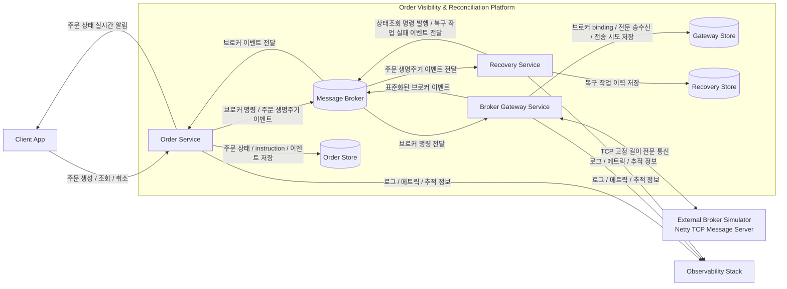
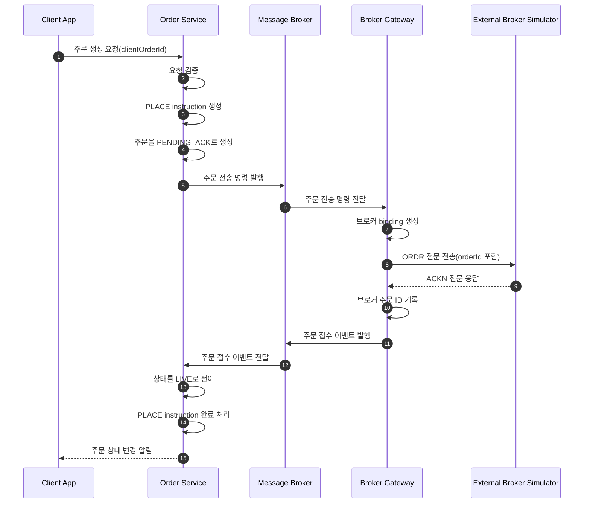
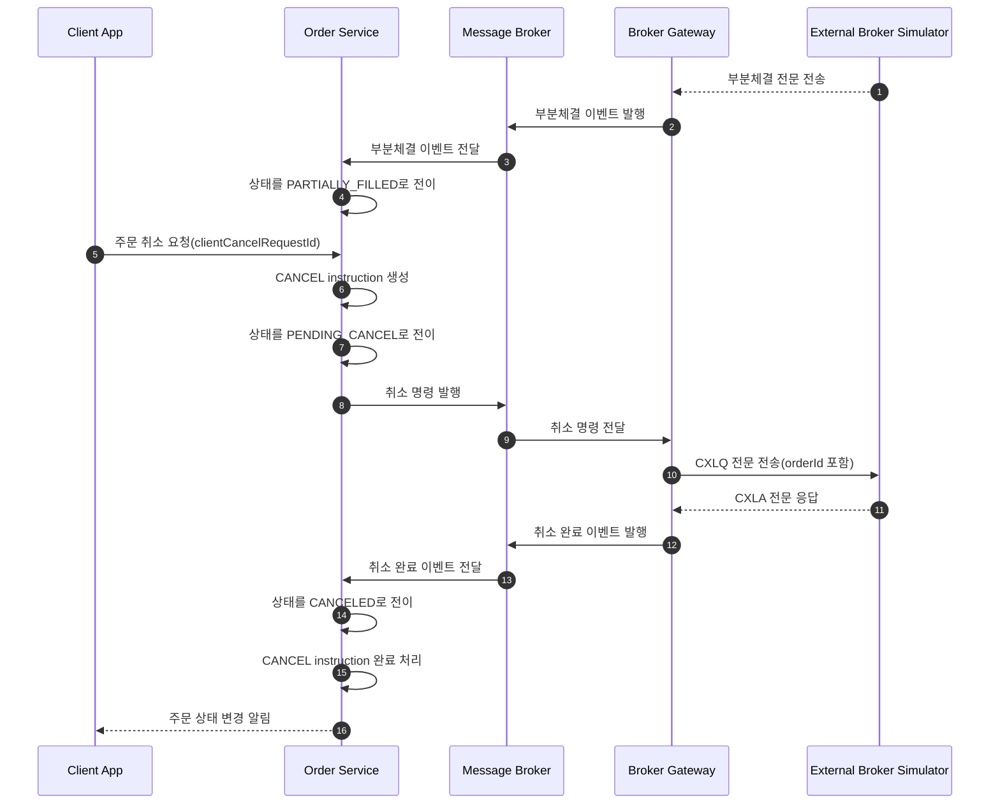
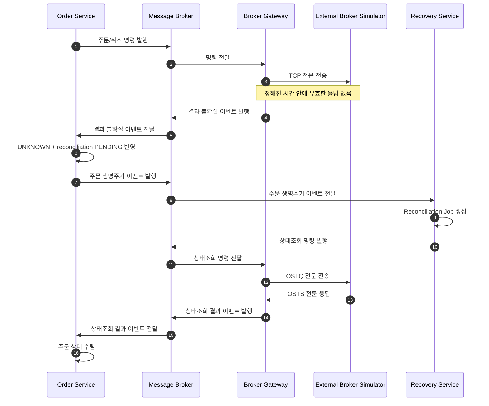
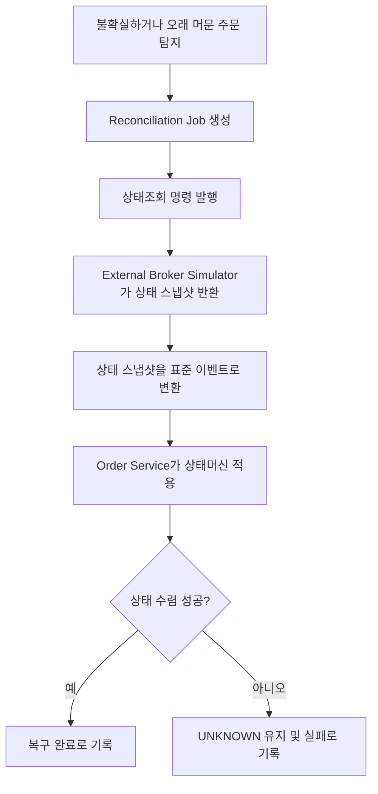
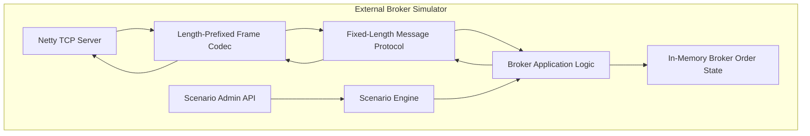

# 7. 아키텍처 개요

## 7.1 목적

이 문서는 앞서 정의한 문제, 요구사항, 도메인 모델, 유스케이스, 품질 속성 시나리오를 만족하기 위한 시스템의 상위 구조를 정의한다.

이 단계의 목적은 다음을 명확히 하는 것이다.

1. 시스템을 어떤 주요 컴포넌트로 나눌 것인가?
2. 각 컴포넌트는 어떤 책임을 가지는가?
3. 주문 상태의 소유권은 어디에 둘 것인가?
4. 외부 브로커 통신은 어디에 격리할 것인가?
5. 비동기 메시징과 복구 흐름은 어떻게 구성할 것인가?
6. 향후 멀티 브로커와 운영 콘솔 확장을 어디에 붙일 것인가?

---

## 7.2 아키텍처 드라이버

| Driver | 관련 품질 속성 | 아키텍처에 주는 영향 |
|---|---|---|
| 주문 생성/취소 instruction 보존 | Reliability | 정상 접수된 OrderInstruction이 중간 장애로 유실되지 않도록 영속화와 재시도 구조가 필요 |
| 중복/순서 역전 이벤트 대응 | Consistency | 주문 상태 변경은 단일 상태머신에서 수행되어야 함 |
| 외부 응답 불확실성 처리 | Recoverability | `UNKNOWN` 상태와 상태조회 기반 복구 흐름 필요 |
| 브로커 장애 격리 | Fault Isolation | 사용자 API와 브로커 통신을 분리해야 함 |
| 상태 변화 원인 추적 | Observability / Operability | 주문 이벤트 이력, instruction 처리 이력, 브로커 송수신 이력, 복구 이력 필요 |
| 브로커 추가/교체 | Modifiability | 브로커 통신 포맷과 주문 도메인 모델을 분리해야 함 |
| 장애 시나리오 재현 | Testability | stateful broker simulator와 scenario injection 필요 |

---

## 7.3 아키텍처 스타일

## 7.3.1 기본 스타일

본 시스템은 다음 스타일을 조합한다.

| 스타일                            | 적용 이유                                          |
| ------------------------------ | ---------------------------------------------- |
| Service-oriented decomposition | Order, Broker Gateway, Recovery 책임을 분리하기 위해 사용 |
| Event-driven architecture      | 외부 브로커 이벤트와 내부 상태 변경을 비동기로 연결하기 위해 사용          |
| State machine 중심 도메인 모델        | 주문 상태와 수량 정합성을 일관되게 관리하기 위해 사용                 |
| Adapter pattern                | 브로커 전문 통신을 주문 도메인에서 격리하기 위해 사용                 |
| Reliable messaging pattern     | 정상 접수된 주문/취소 요청과 이벤트 발행 유실을 방지하기 위해 사용         |
| Reconciliation pattern         | 외부 상태와 내부 상태 불일치를 최종적으로 수렴시키기 위해 사용            |

---

## 7.3.2 1차 구현 아키텍처 방향

Phase 1에서는 다음 구조를 사용한다.

* 사용자-facing API와 주문 상태 소유권은 **Order Service**에 둔다.
* 외부 브로커 TCP 전문 통신은 **Broker Gateway Service**에 격리한다.
* `UNKNOWN`, stale order, 상태조회 기반 복구는 **Recovery Service**가 담당한다.
* 서비스 간 명령과 이벤트 전달은 **비동기 메시징**으로 처리한다.
* Broker Mock은 시스템 외부의 **External Broker Simulator**로 둔다.
* Broker Simulator는 Netty 기반 TCP fixed-length message server로 구현한다.

---

# 7.4 전체 컨테이너 아키텍처

## 7.4.1 Container Diagram



---

## 7.4.2 핵심 해석

이 구조의 핵심은 다음이다.

1. **Order Service가 주문 상태의 단일 소유자다.**
   - 주문 상태 변경은 Order Service의 상태머신을 통해서만 발생한다.
   - Broker Gateway와 Recovery Service는 주문 상태를 직접 변경하지 않는다.
   - Order Service는 OrderInstruction의 처리 상태를 관리한다.

2. **Broker Gateway는 외부 브로커 통신을 격리한다.**
   - TCP 전문 파싱, 직렬화, malformed 처리, 브로커 송수신 기록은 Gateway 내부 책임이다.
   - 브로커 선택, 브로커 주문 ID, 브로커 전문 단위 식별자는 Gateway가 소유한다.
   - Gateway는 브로커 전문을 Order Service가 처리 가능한 canonical broker event로 변환한다.
   - Order Service는 TCP 전문 포맷과 브로커별 식별자 구조를 알지 않는다.

3. **Recovery Service는 복구 흐름을 오케스트레이션한다.**

   * `UNKNOWN` 주문, stale non-terminal 주문, 상태조회 기반 복구를 담당한다.
   * 실제 주문 상태 반영은 Order Service가 수행한다.

4. **Message Broker는 서비스 간 비동기 연결 수단이다.**

   * 메시징은 주문 상태의 source of truth가 아니다.
   * 주문 상태의 공식 판단은 Order Service에 있다.

5. **External Broker Simulator는 시스템 외부로 취급한다.**

   * 직접 구현하지만 실제 외부 브로커를 대체하는 test double이다.
   * 향후 멀티 브로커 또는 실제 연계로 교체 가능한 경계로 둔다.

---

# 7.5 주요 컴포넌트 책임

## 7.5.1 Order Service

Order Service는 주문 상태의 source of truth다.

### 주요 책임

- 주문 생성 API 제공
- 주문 조회 API 제공
- 주문 취소 API 제공
- SSE 기반 주문 상태 알림 제공
- OrderInstruction 멱등성 처리
- OrderInstruction 처리 상태 관리
- 주문 상태머신 실행
- 주문 수량 불변식 검증
- 외부 브로커 canonical event 적용
- `UNKNOWN` 상태 반영
- reconciliation 결과 반영
- 주문 이벤트 이력 생성
- 주문 상태 변경 후 lifecycle event 발행

### 소유 데이터

- 주문 현재 상태
- 주문 instruction 이력 및 현재 처리 상태
- 주문 이벤트 이력
- 주문별 reconciliation 상태
- 주문 상태 변경 발행 대상 메시지

### 하지 않는 일

- TCP 연결 관리
- 전문 파싱/직렬화
- 브로커별 프로토콜 처리
- 브로커 코드 또는 브로커 주문 ID를 이용한 상태 판단
- 브로커 상태 직접 조회
- 외부 브로커 장애 판단

---

## 7.5.2 Broker Gateway Service

Broker Gateway Service는 외부 브로커와의 통신 어댑터다.

### 주요 책임

* 비동기 broker command 수신
* 주문 요청 전문 생성
* 취소 요청 전문 생성
* 상태조회 전문 생성
* Netty TCP client 기반 브로커 통신
* length-prefixed frame encode/decode
* common header parse/serialize
* fixed-length body parse/serialize
* 전문 ID별 parser/serializer dispatch
* malformed 전문 분류
* raw 전문 송수신 journal 기록
* command attempt 이력 기록
* 브로커 응답 전문을 canonical broker event로 변환
* broker event 발행
* command timeout 감지

### 소유 데이터

- 브로커 주문 binding
- 브로커 송수신 전문 journal
- command attempt 이력
- broker event 발행 대상 메시지

### 하지 않는 일

- 주문 상태 직접 변경
- 주문 수량 불변식 판단
- 사용자-facing API 제공
- reconciliation 결과 해석
- 사용자 instruction 멱등성 판단

---

## 7.5.3 Recovery Service

Recovery Service는 불확실한 주문 상태를 복구 대상으로 식별하고 상태조회 기반 수렴을 오케스트레이션한다.

### 주요 책임

* `UNKNOWN` 주문 감지
* 미확정 non-terminal 주문 감지
* reconciliation job 생성
* 상태조회 command 생성
* reconciliation 시도 이력 관리
* 취소 의도 유지 후 자동 재시도 트리거
* 재시도 한도 관리
* 복구 실패 이력 기록
* 복구 최종 실패 이벤트 발행

### 소유 데이터

* reconciliation job
* reconciliation attempt
* 복구 실패 이력
* 상태조회 command 발행 대상 메시지

### 하지 않는 일

* 주문 상태 직접 변경
* TCP 전문 직접 송수신
* 브로커 전문 파싱
* 사용자-facing API 제공

---

## 7.5.4 External Broker Simulator

Broker Simulator는 실제 외부 브로커를 대체하는 stateful simulator다.

### 주요 책임

* TCP 서버로 Gateway 연결 수락
* length-prefixed frame 처리
* common header 처리
* fixed-length body parser/serializer 제공
* 주문 접수/거절
* 부분체결/완전체결 이벤트 생성
* 취소 완료/취소 거절 이벤트 생성
* DAY 주문 만료 이벤트 생성
* 상태조회 응답 반환
* malformed 전문 전송 시나리오 제공
* 지연/유실/중복/순서 역전 시나리오 제공

### 소유 상태

- broker-side order state
- `orderId -> broker-side order`
- `brokerOrderId -> broker-side order`
- scenario configuration

### 하지 않는 일

* 실제 주문장 매칭
* 실제 FIX 프로토콜 구현
* 실제 시장 시세 반영
* 계좌/잔고/정산 처리

---

## 7.5.5 Observability Stack

Observability Stack은 운영 및 테스트 분석을 위한 외부 지원 시스템이다.

### 주요 책임

* 애플리케이션 로그 수집
* 주요 메트릭 수집
* 추적 식별자 기반 흐름 분석
* 대시보드 제공
* 장애 시나리오 테스트 결과 분석 보조

### 주요 관측 대상

* 주문 상태별 개수
* `UNKNOWN` 진입 수
* reconciliation 성공/실패 수
* 브로커 응답 지연
* malformed 전문 수
* 중복 이벤트 수
* 상태 전이 실패 수
* 사용자-facing API 지연
* SSE 전달 지연

---

# 7.6 주요 런타임 흐름

## 7.6.1 신규 주문 정상 흐름



### 설명

사용자가 주문을 생성하면 Order Service는 `PLACE` instruction을 접수하고 주문을 `PENDING_ACK` 상태로 생성한다.  
브로커 전송은 Broker Gateway가 담당한다. Gateway는 브로커 전문에 `orderId`를 포함해 전송하고, 브로커 ACK를 canonical event로 변환한다.  
Order Service는 canonical event를 적용해 주문 상태를 `LIVE`로 변경하고 `PLACE` instruction을 완료 처리한다.

---

## 7.6.2 부분체결 후 취소 흐름



### 설명

부분체결 후 취소 요청은 체결분을 취소하지 않는다.  
Order Service는 미체결 잔량에 대한 `CANCEL` instruction을 생성하고 주문을 `PENDING_CANCEL`로 전환한다.  
브로커 취소 완료 이벤트가 들어오면 주문을 `CANCELED`로 종결하고 `CANCEL` instruction을 완료 처리한다.

---

## 7.6.3 응답 timeout 후 UNKNOWN 및 reconciliation 흐름



### 설명

브로커 응답이 불확실한 경우 시스템은 주문을 실패로 단정하지 않는다.
`UNKNOWN`으로 격리한 뒤 Recovery Service가 상태조회 기반으로 상태를 수렴시킨다.

---

# 7.7 상태 소유권과 데이터 흐름 원칙

## 7.7.1 주문 상태 소유권

주문 상태는 Order Service가 단독 소유한다.

| 작업                   | 담당                                |
| -------------------- | --------------------------------- |
| 주문 생성                | Order Service                     |
| 주문 상태 변경             | Order Service                     |
| 주문 수량 불변식 검증         | Order Service                     |
| 취소 상태 변경          | Order Service                     |
| 브로커 전문 파싱            | Broker Gateway                    |
| 브로커 상태조회 요청          | Recovery Service → Broker Gateway |
| reconciliation 결과 적용 | Order Service                     |

### 원칙

> Broker Gateway와 Recovery Service는 주문 상태를 직접 변경하지 않는다.
> 이들은 관측된 사실 또는 복구 요청을 전달하고, Order Service가 상태머신을 통해 최종 상태를 결정한다.

---

## 7.7.2 외부 브로커 통신 격리

외부 브로커 통신은 Broker Gateway에 격리한다.

| 관심사                       | 위치                                |
| ------------------------- | --------------------------------- |
| TCP 연결                    | Broker Gateway                    |
| length-prefixed frame     | Broker Gateway / Broker Simulator |
| fixed-length body parsing | Broker Gateway / Broker Simulator |
| malformed 전문 처리           | Broker Gateway                    |
| canonical event 변환        | Broker Gateway                    |
| 주문 상태 반영                  | Order Service                     |

### 원칙

> Order Service는 브로커 전문 포맷을 알지 않는다.
> Order Service는 canonical broker event만 처리한다.

---

## 7.7.3 비동기 메시징 원칙

서비스 간 상호작용은 가능한 비동기 메시지로 연결한다.

### 비동기화 대상

* 주문 생성 후 브로커 전송 요청
* 취소 요청 후 브로커 취소 요청
* 브로커 응답 이벤트 전달
* 주문 lifecycle event 전달
* reconciliation 상태조회 요청

### 동기 처리 대상

* 사용자 주문 생성 요청 접수
* 사용자 주문 조회
* 사용자 주문 취소 요청 접수
* SSE 연결 수립

### 원칙

> 사용자-facing API는 외부 브로커 응답에 동기 의존하지 않는다.
> 주문 접수와 외부 브로커 처리 결과 반영은 분리한다.

---

# 7.8 내부 메시지 흐름 개요

세부 토픽명과 스키마는 10단계에서 정의한다.
이 단계에서는 메시지 방향만 정의한다.

## 7.8.1 Command 흐름

```text
Order Service / Recovery Service
  -> Broker Command
  -> Broker Gateway
  -> External Broker Simulator
```

### Command 종류

* Submit Order
* Cancel Order
* Query Order Status

Submit Order command는 Order Service가 `PLACE` instruction 접수 후 발행한다.  
Cancel Order command는 Order Service가 `CANCEL` instruction 접수 또는 reconciliation 이후 active `CANCEL` instruction 재시도 시 발행한다.

---

## 7.8.2 Broker Event 흐름

```text
External Broker Simulator
  -> Broker Gateway
  -> Canonical Broker Event
  -> Order Service
```

### Broker Event 종류

* Broker Order Acknowledged
* Broker Order Rejected
* Broker Order Partially Filled
* Broker Order Filled
* Broker Cancel Acknowledged
* Broker Cancel Rejected
* Broker Order Expired
* Broker Order Status Snapshot
* Broker Command Outcome Unknown

---

## 7.8.3 Lifecycle Event 흐름

```text
Order Service
  -> Order Lifecycle Event
  -> Recovery Service / Observability consumers
```

### Lifecycle Event 종류

* Order Created
* Order Status Changed
* Order Became Unknown
* Reconciliation Required
* Reconciliation Resolved
* Reconciliation Failed (snapshot 적용 실패)
* Order Terminalized

---

## 7.8.4 Reconciliation Job Event 흐름

```text
Recovery Service
  -> Reconcililation Job Event
  -> Order Service
```

### Reconciliation Job Event 종류

* Reconciliation Job Failed 

---

# 7.9 Reliable processing 개요

이 단계에서는 구체 구현 테이블을 정의하지 않는다.
다만 품질 속성을 만족하기 위한 reliable processing 요구를 아키텍처 수준에서 명시한다.

## 7.9.1 발행 신뢰성

정상 접수된 주문/취소 요청과 상태 변화 이벤트는 중간 장애로 사라지면 안 된다.

따라서 메시지를 발행하는 컴포넌트는 다음을 보장해야 한다.

* 업무 상태 변경과 발행 대상 메시지가 불일치하지 않도록 관리한다.
* 발행 실패 시 재시도 가능해야 한다.
* 재시작 후에도 미처리 발행 대상을 복구할 수 있어야 한다.

구체 구현 방식은 ADR에서 결정한다.

후보:

* Transactional Outbox
* Persistent command queue
* Database polling
* Broker-native transactional publishing

---

## 7.9.2 소비 멱등성

외부 이벤트나 내부 메시지가 중복 전달되더라도 상태가 중복 변경되면 안 된다.

따라서 메시지를 소비하는 컴포넌트는 다음을 보장해야 한다.

* 이미 처리한 논리 이벤트를 식별할 수 있어야 한다.
* 동일 이벤트를 재처리하더라도 상태 변경은 한 번만 일어나야 한다.
* 동일 이벤트에 다른 payload가 들어오면 정상 중복이 아니라 anomaly로 처리해야 한다.

구체 구현 방식은 ADR에서 결정한다.

후보:

* Processed message record
* Semantic dedup key
* Idempotent state transition
* Versioned aggregate update

---

# 7.10 복구 아키텍처 개요

## 7.10.1 복구 대상

다음 주문은 복구 대상으로 본다.

* `UNKNOWN` 주문
* 오래 머무는 non-terminal 주문
* malformed 또는 식별 불가능한 이벤트 이후 의심되는 주문
* 장 마감 이후 terminal 상태가 아닌 DAY 주문
* 취소 요청 후 결과가 불확실한 주문

---

## 7.10.2 복구 흐름



---

## 7.10.3 복구 결과

| Snapshot | 결과 |
|---|---|
| `ACCEPTED` | `LIVE` 또는 active `CANCEL` instruction이 있으면 `PENDING_CANCEL` |
| `PARTIAL` | `PARTIALLY_FILLED` 또는 active `CANCEL` instruction이 있으면 `PENDING_CANCEL` |
| `FILLED` | `FILLED` |
| `CANCELED` | `CANCELED` |
| `REJECTED` | `REJECTED` |
| `EXPIRED` | `EXPIRED` |
| `NOT_FOUND` | 자동 종결하지 않고 `UNKNOWN + FAILED` |

---

# 7.11 Broker Simulator 아키텍처 개요

Broker Simulator는 시스템 내부 핵심 컴포넌트가 아니라 외부 브로커 대역이다.
다만 테스트 가능성을 위해 프로젝트에서 직접 구현한다.

## 7.11.1 내부 구조



---

## 7.11.2 책임

* 주문 접수/거절
* 부분체결/완전체결
* 취소 완료/취소 거절
* DAY 주문 만료
* 상태조회 응답
* malformed 전문 전송
* 지연/유실/중복/순서 역전 시나리오 재현

---

# 7.12 향후 확장 지점

## 7.12.1 멀티 브로커 라우팅 / fallback

Phase 2에서는 Broker Gateway에 다음 요소를 추가한다.

* Broker registry
* Broker health state
* Routing policy
* Fallback policy
* Broker-specific adapter
* Broker별 latency/failure metric

Order Service의 주문 상태 모델은 변경하지 않는다.

---

## 7.12.2 운영 콘솔

Phase 2 이후 운영 콘솔을 추가한다.

운영 콘솔은 다음 정보를 조회한다.

- 주문 이벤트 타임라인
- 주문 instruction 처리 이력
- 브로커 전문 송수신 이력
- command attempt 이력
- reconciliation job 이력
- malformed 전문 이력
- `UNKNOWN` 주문 목록
- 수동 reconciliation trigger

운영 콘솔은 신규 상태 변경 주체가 아니다.
상태 변경은 여전히 Order Service와 정의된 recovery flow를 통해 수행된다.

---

## 7.12.3 다른 브로커 통신 방식

향후 다른 브로커 통신 방식이 추가되더라도 다음 경계를 유지한다.

```text
Broker-specific protocol
  -> Broker Gateway Adapter
  -> Canonical Broker Event
  -> Order Service State Machine
```

따라서 주문 도메인 모델은 브로커 프로토콜 변경에 직접 영향받지 않는다.

---

# 7.13 아키텍처 결정 후보

다음 항목은 8단계 ADR / DDR에서 별도 결정한다.

| 결정 후보             | 질문                                                               |
| ----------------- | ---------------------------------------------------------------- |
| 서비스 분리 방식         | Order, Gateway, Recovery를 물리적으로 분리할 것인가, 모듈러 모놀리식으로 시작할 것인가?     |
| 메시징 기술            | 어떤 메시지 브로커를 사용할 것인가?                                             |
| 발행 신뢰성            | reliable publication을 어떤 패턴으로 보장할 것인가?                           |
| 소비 멱등성            | 중복 메시지 처리를 어떤 방식으로 보장할 것인가?                                      |
| 상태 저장소            | 서비스별 데이터 소유권과 저장소 분리를 어떻게 할 것인가?                                 |
| SSE 구현 방식         | Order Service 내부에서 직접 관리할 것인가, 별도 notification component를 둘 것인가? |
| Broker Gateway 구현 | Netty TCP client를 Gateway 내부에 둘 것인가, 별도 라이브러리/모듈로 분리할 것인가?       |
| Recovery trigger  | UNKNOWN event 기반, polling 기반, scheduled detector를 어떻게 조합할 것인가?   |
| EOD 처리            | 시장 `CLOSED` 전환 이후 어떤 시점에 non-terminal DAY 주문을 sweep할 것인가?        |

---

## 7.14 확정 사항 요약

| 항목 | 결정 |
|---|---|
| 주요 서비스 | Order Service, Broker Gateway Service, Recovery Service |
| 주문 상태 소유권 | Order Service 단독 소유 |
| 주문 instruction 처리 | Order Service가 OrderInstruction의 멱등성과 처리 상태를 관리 |
| 외부 브로커 통신 | Broker Gateway Service에 격리 |
| 브로커 정보 소유권 | Broker Gateway가 브로커 binding, 브로커 주문 ID, 전문 송수신 이력을 소유 |
| 복구 흐름 | Recovery Service가 오케스트레이션, 상태 반영은 Order Service가 수행 |
| Broker Simulator | 시스템 외부로 취급하되 프로젝트에서 직접 구현 |
| 사용자 API | 외부 브로커 응답에 동기 의존하지 않음 |
| 서비스 간 연결 | 비동기 메시징 중심 |
| Reliable processing 세부 구현 | ADR에서 결정 |
| Phase 2 확장 | 멀티 브로커 라우팅/fallback → 운영 콘솔 |
| 다이어그램 표기 | 엔티티명은 영어, 설명/흐름/화살표는 한국어 중심 |
