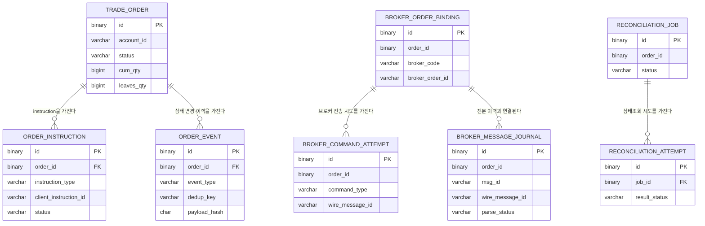

# 9. DB 설계

## 9.1 목적

이 문서는 MySQL 기반 데이터 모델을 정의한다.

DB 설계의 목표는 다음이다.

1. 주문 상태의 source of truth를 명확히 한다.
2. 사용자 주문/취소 instruction의 멱등성과 처리 상태를 관리한다.
3. 주문 상태 변경 이력과 상태 변경 원인을 추적 가능하게 남긴다.
4. 외부 브로커 전문 송수신 이력을 운영 분석 가능하게 저장한다.
5. `UNKNOWN`, stale order, reconciliation 흐름을 추적 가능하게 한다.
6. 메시지 발행/소비 신뢰성을 보강하기 위한 Outbox / Processed Message 구조를 둔다.
7. 향후 멀티 브로커와 운영 콘솔 확장을 고려한다.

---

## 9.2 MySQL 설계 전제

### 9.2.1 DBMS

* MySQL 8.x 기준
* `JSON` 컬럼 사용 가능
* `DATETIME(3)` 사용
* 주요 비즈니스 제약은 애플리케이션 상태머신에서 검증
* 실제 DDL은 Flyway 또는 Liquibase migration 파일로 분리한다

---

### 9.2.2 시간 타입

모든 업무 시간 컬럼은 `DATETIME(3)`을 사용한다.

| 항목         | 결정                          |
| ---------- | --------------------------- |
| 저장 기준      | UTC                         |
| MySQL 타입   | `DATETIME(3)`               |
| Java 타입 후보 | `Instant`, `OffsetDateTime` |
| 비고         | timezone 변환은 애플리케이션 계층에서 통제 |

---

### 9.2.3 ID 타입

내부 ID는 **UUID v7을 애플리케이션에서 생성**하고 MySQL에는 `BINARY(16)`으로 저장한다.

| 항목                               | 결정           |
| -------------------------------- | ------------ |
| ID 생성 주체                         | Java 애플리케이션  |
| UUID 버전                          | UUID v7      |
| MySQL 저장 타입                      | `BINARY(16)` |
| MySQL `UUID()` 사용 여부             | 사용하지 않음      |
| `UUID_TO_BIN(uuid, 1)` swap flag | 사용하지 않음      |

적용 대상:

* `trade_order.id`
* `order_instruction.id`
* `order_event.id`
* `outbox_message.id`
* `broker_order_binding.id`
* `broker_command_attempt.id`
* `broker_message_journal.id`
* `reconciliation_job.id`
* `reconciliation_attempt.id`

설계 메모:

* UUID v7은 시간 정렬성이 있어 UUID v4보다 인덱스 locality 측면에서 유리하다.
* MySQL은 UUID v7 생성 함수를 기본 제공하지 않으므로 애플리케이션에서 생성한다.
* 운영 조회 편의는 `client_instruction_id`, `wire_message_id`, `trace_id`, `broker_order_id` 같은 문자열 식별자로 보완한다.

---

### 9.2.4 테이블명 / PK 컨벤션

| 항목     | 결정                                                                 |
| ------ | ------------------------------------------------------------------ |
| 테이블명   | 단수형                                                                |
| PK 컬럼명 | `id`                                                               |
| FK 컬럼명 | 참조 대상 의미를 드러내는 이름 사용. 예: `order_id`, `job_id`, `source_message_id` |
| 예약어 회피 | `order` 대신 `trade_order` 사용                                        |

예:

```text
trade_order.id
order_instruction.order_id
order_event.order_id
reconciliation_attempt.job_id
```

---

### 9.2.5 Enum 저장 방식

MySQL `ENUM` 타입은 사용하지 않는다.

| 항목    | 결정                        |
| ----- | ------------------------- |
| 저장 타입 | `VARCHAR`                 |
| 검증 위치 | Java enum + 애플리케이션 검증     |
| 이유    | 상태 추가/변경 시 DDL 영향을 줄이기 위함 |

---

### 9.2.6 서비스별 Database 분리

하나의 MySQL 인스턴스를 사용하더라도 논리적으로 database를 분리한다.

| Database      | 소유 서비스                 |
| ------------- | ---------------------- |
| `order_db`    | Order Service          |
| `gateway_db`  | Broker Gateway Service |
| `recovery_db` | Recovery Service       |

원칙:

> 서비스 간 cross-database foreign key는 사용하지 않는다.
> 다른 서비스의 ID는 참조 값으로만 저장한다.

---

# 9.3 주요 식별자 모델

## 9.3.1 식별자 역할

| 식별자                     | 저장 타입         | 생성 주체               | 고유 범위                                                   | 목적                    |
| ----------------------- | ------------- | ------------------- | ------------------------------------------------------- | --------------------- |
| `trade_order.id`        | `BINARY(16)`  | Order Service       | 전역 고유                                                   | 내부 Order aggregate 식별 |
| `order_instruction.id`  | `BINARY(16)`  | Order Service       | 전역 고유                                                   | 사용자 instruction 식별    |
| `client_instruction_id` | `VARCHAR(64)` | Client              | `account_id + instruction_type + client_instruction_id` | 사용자 instruction 멱등성   |
| `broker_order_id`       | `VARCHAR(64)` | Broker Simulator    | `broker_code + broker_order_id`                         | 브로커 측 주문 식별           |
| `wire_message_id`       | `VARCHAR(64)` | 전문 송신자              | `broker_code + msg_id + wire_message_id`                | 전문 단위 식별              |
| `trace_id`              | `VARCHAR(64)` | Client 또는 최초 진입 서비스 | trace 단위                                                | end-to-end 관측성 추적     |

---

## 9.3.2 `clientOrderId`, `clientCancelRequestId`의 위치

API 레벨에서는 사용자 의미에 맞는 이름을 사용한다.

| API 필드                  | DB 내부 표현                                                                                       |
| ----------------------- | ---------------------------------------------------------------------------------------------- |
| `clientOrderId`         | `order_instruction.instruction_type = PLACE`, `client_instruction_id = clientOrderId`          |
| `clientCancelRequestId` | `order_instruction.instruction_type = CANCEL`, `client_instruction_id = clientCancelRequestId` |

즉, DB 내부에서는 사용자 instruction 멱등성 키를 `client_instruction_id`로 일반화한다.

취소 요청의 API path `orderId`는 멱등성 unique key 자체에는 포함하지 않는다.
대신 `order_instruction.order_id`에 대상 주문으로 저장하고, 같은 취소 멱등성 키가 동일 주문에 대한 재시도인지 확인하기 위한 `request_payload_hash` 입력에 포함한다.
따라서 같은 `account_id + CANCEL + clientCancelRequestId`가 다른 `order_id`에 재사용되면 멱등성 충돌로 처리한다.

---

## 9.3.3 주문 ID 매핑 관계

주문 생성 흐름에서 다음 관계가 형성된다.

```text
accountId + instructionType + clientInstructionId
        ↓
order_instruction.id
        ↓
trade_order.id
```

브로커에 주문이 접수되면 Gateway 내부에서 다음 관계가 추가된다.

```text
trade_order.id
        ↓
broker_code + broker_order_id
```

중요한 점:

* Order Service는 브로커 식별자를 도메인 상태 판단에 사용하지 않는다.
* Broker Gateway가 브로커 식별자와 전문 송수신을 소유한다.
* 두 서비스 사이의 계약은 `order_id`를 포함한 canonical broker event다.

---

# 9.4 전체 테이블 목록

| Database      | Table                    | 소유 서비스           | 목적                                |
| ------------- | ------------------------ | ---------------- | --------------------------------- |
| `order_db`    | `trade_order`            | Order Service    | 주문 현재 상태 snapshot                 |
| `order_db`    | `order_instruction`      | Order Service    | 사용자 주문/취소 instruction의 멱등성과 처리 상태 |
| `order_db`    | `order_event`            | Order Service    | 주문 상태 변경 감사 이력 및 브로커 이벤트 dedup    |
| `order_db`    | `outbox_message`         | Order Service    | 발행 대상 메시지 저장                      |
| `order_db`    | `processed_message`      | Order Service    | 소비 메시지 중복 방지                      |
| `gateway_db`  | `broker_order_binding`   | Broker Gateway   | 내부 주문과 브로커 주문 ID 매핑               |
| `gateway_db`  | `broker_command_attempt` | Broker Gateway   | 브로커 command 전송 시도 이력              |
| `gateway_db`  | `broker_message_journal` | Broker Gateway   | TCP 전문 송수신 journal                |
| `gateway_db`  | `outbox_message`         | Broker Gateway   | 발행 대상 broker event 저장             |
| `gateway_db`  | `processed_message`      | Broker Gateway   | 소비 command 중복 방지                  |
| `recovery_db` | `reconciliation_job`     | Recovery Service | 복구 작업 단위                          |
| `recovery_db` | `reconciliation_attempt` | Recovery Service | 상태조회 시도 이력                        |
| `recovery_db` | `outbox_message`         | Recovery Service | 상태조회/재시도 command 발행 대상 저장         |
| `recovery_db` | `processed_message`      | Recovery Service | 소비 lifecycle event 중복 방지          |

총 **14개 테이블**이다.

---

# 9.5 논리 ERD



주의:

* 이 ERD는 논리 관계를 보여주기 위한 것이다.
* 실제 DB에서는 서비스 간 cross-database FK를 만들지 않는다.
* `gateway_db`, `recovery_db`의 `order_id`는 논리 참조다.

---

# 9.6 Order Service DB

## 9.6.1 `trade_order`

`trade_order`는 Order aggregate의 현재 상태 snapshot이다.

주문 생성 instruction과 주문 aggregate는 분리된다.
`PLACE` instruction은 주문 생성을 요청한 사용자 instruction이고, `trade_order`는 그 결과로 생성된 장기 생명주기 aggregate다.

`trade_order`는 브로커 정보를 직접 보유하지 않는다.
브로커 선택, 브로커 주문 ID, 전문 송수신은 Broker Gateway의 책임이다.

### 컬럼

| 컬럼                      | 타입              | NULL | 설명                 |
| ----------------------- | --------------- | ---: | ------------------ |
| `id`                    | `BINARY(16)`    |    N | 주문 ID, UUID v7     |
| `account_id`            | `VARCHAR(64)`   |    N | 계좌 또는 사용자 식별자      |
| `market`                | `VARCHAR(16)`   |    N | Phase 1에서는 `US`    |
| `symbol`                | `VARCHAR(32)`   |    N | 종목 코드              |
| `side`                  | `VARCHAR(8)`    |    N | `BUY`, `SELL`      |
| `order_type`            | `VARCHAR(16)`   |    N | `LIMIT`            |
| `tif`                   | `VARCHAR(8)`    |    N | `DAY`              |
| `order_qty`             | `BIGINT`        |    N | 최초 주문 수량           |
| `limit_price`           | `DECIMAL(19,4)` |    N | 지정가                |
| `status`                | `VARCHAR(32)`   |    N | 주문 상태              |
| `reconciliation_status` | `VARCHAR(32)`   |    N | 복구 상태              |
| `cum_qty`               | `BIGINT`        |    N | 누적 체결 수량           |
| `leaves_qty`            | `BIGINT`        |    N | 남은 미체결 수량          |
| `version`               | `BIGINT`        |    N | optimistic locking |
| `created_at`            | `DATETIME(3)`   |    N | 생성 시각              |
| `updated_at`            | `DATETIME(3)`   |    N | 수정 시각              |
| `terminal_at`           | `DATETIME(3)`   |    Y | 종결 시각              |

### 주요 인덱스

| 인덱스 | 컬럼                                  | 목적                     |
| --- | ----------------------------------- | ---------------------- |
| PK  | `id`                                | 주문 단건 식별               |
| IDX | `account_id, created_at`            | 계좌별 주문 목록              |
| IDX | `status, updated_at`                | 상태별 조회, stale order 탐지 |
| IDX | `reconciliation_status, updated_at` | 복구 대상 조회               |

### 상태 값

`status`

* `PENDING_ACK`
* `LIVE`
* `PARTIALLY_FILLED`
* `PENDING_CANCEL`
* `UNKNOWN`
* `FILLED`
* `CANCELED`
* `REJECTED`
* `EXPIRED`

`reconciliation_status`

* `NONE`
* `PENDING`
* `RESOLVED`
* `FAILED`

### 설계 메모

* `trade_order`는 정적 주문 요청 정보와 동적 주문 상태를 함께 보유한다.
* `reconciliation_status`는 주문 관점의 복구 필요/결과 상태만 표현한다.
* Reconciliation workflow 실행 상태인 `RUNNING`은 Recovery Service의 `reconciliation_job.status`에서 관리한다.
* Phase 1에서는 이를 1:1 테이블로 분리하지 않는다.
* `avg_fill_price`, `last_fill_price`는 두지 않는다.
* Phase 1의 체결 모델은 수량 중심이다.
* `status_reason_code`, `status_reason_text`는 두지 않는다.
* 상태 변경 사유는 `order_event.payload_json`에 남긴다.
* 브로커 관련 정보는 저장하지 않는다.
* 상태 전이 시 `version`을 증가시켜 낙관적 락을 적용한다.
* 취소 요청 생성처럼 주문 단위 직렬화가 필요한 경우 `SELECT ... FOR UPDATE`를 사용한다.

---

## 9.6.2 `order_instruction`

`order_instruction`은 특정 주문에 대해 사용자가 요청한 instruction의 처리 상태를 관리한다.

Phase 1에서는 다음 두 instruction을 사용한다.

* `PLACE`: 주문 생성 instruction
* `CANCEL`: 잔량 취소 instruction

`order_instruction`은 이벤트 로그가 아니다.
장기 실행 instruction의 현재 처리 상태와 멱등성을 관리하는 테이블이다.

### 컬럼

| 컬럼                      | 타입             | NULL | 설명                      |
| ----------------------- | -------------- | ---: | ----------------------- |
| `id`                    | `BINARY(16)`   |    N | instruction ID, UUID v7 |
| `order_id`              | `BINARY(16)`   |    N | 대상 주문 ID                |
| `account_id`            | `VARCHAR(64)`  |    N | 계좌 또는 사용자 식별자           |
| `instruction_type`      | `VARCHAR(32)`  |    N | `PLACE`, `CANCEL`       |
| `client_instruction_id` | `VARCHAR(64)`  |    N | 클라이언트 instruction 멱등성 키 |
| `status`                | `VARCHAR(32)`  |    N | instruction 처리 상태       |
| `retry_count`           | `INT`          |    N | 자동 재시도 횟수               |
| `request_payload_json`  | `JSON`         |    N | instruction 요청 payload  |
| `request_payload_hash`  | `CHAR(64)`     |    N | 요청 payload hash         |
| `result_code`           | `VARCHAR(64)`  |    Y | instruction 결과 코드       |
| `result_message`        | `VARCHAR(512)` |    Y | instruction 결과 설명       |
| `trace_id`              | `VARCHAR(64)`  |    Y | traceId                 |
| `created_at`            | `DATETIME(3)`  |    N | 생성 시각                   |
| `updated_at`            | `DATETIME(3)`  |    N | 수정 시각                   |
| `resolved_at`           | `DATETIME(3)`  |    Y | 결과 확정 시각                |

### 주요 인덱스

| 인덱스 | 컬럼                                                    | 목적                        |
| --- | ----------------------------------------------------- | ------------------------- |
| PK  | `id`                                                  | instruction 식별            |
| UK  | `account_id, instruction_type, client_instruction_id` | instruction 멱등성           |
| IDX | `order_id, instruction_type, status`                  | 주문별 active instruction 조회 |
| IDX | `status, updated_at`                                  | 상태별 instruction 조회        |
| IDX | `trace_id`                                            | trace 기반 조회               |

### 상태 값

Phase 1에서는 `PLACE`, `CANCEL` instruction 모두 아래 상태 집합을 사용한다.

* `REQUESTED`
* `COMPLETED`
* `REJECTED`
* `NOT_APPLIED`
* `FAILED`

상태 의미는 instruction type에 따라 해석한다.

#### `PLACE` 예시

| status        | 의미                                 |
| ------------- | ---------------------------------- |
| `REQUESTED`   | 주문 생성 instruction 접수, 브로커 접수 결과 대기 |
| `COMPLETED`   | 브로커가 주문을 접수하여 주문이 활성화됨             |
| `REJECTED`    | 브로커가 주문을 거절함                       |
| `FAILED`      | 주문 생성 처리 또는 복구 실패                  |
| `NOT_APPLIED` | Phase 1에서는 일반적으로 사용하지 않음           |

#### `CANCEL` 예시

| status        | 의미                                 |
| ------------- | ---------------------------------- |
| `REQUESTED`   | 취소 instruction 접수, 취소 완료/거절/미적용 대기 |
| `COMPLETED`   | 미체결 잔량 취소 완료                       |
| `REJECTED`    | 브로커가 취소 요청을 명시적으로 거절               |
| `NOT_APPLIED` | 취소 전 전량 체결 또는 만료되어 취소할 잔량이 없어짐     |
| `FAILED`      | 자동 재시도 한도 초과 또는 복구 실패              |

### `result_code` 예시

| instruction_type | status        | result_code                   | 의미              |
| ---------------- | ------------- | ----------------------------- | --------------- |
| `PLACE`          | `COMPLETED`   | `BROKER_ORDER_ACK`            | 브로커 주문 접수       |
| `PLACE`          | `REJECTED`    | `BROKER_ORDER_REJECTED`       | 브로커 주문 거절       |
| `PLACE`          | `FAILED`      | `RECONCILIATION_FAILED`       | 주문 접수 상태 복구 실패  |
| `CANCEL`         | `COMPLETED`   | `BROKER_CANCEL_ACK`           | 브로커 취소 완료       |
| `CANCEL`         | `REJECTED`    | `BROKER_CANCEL_REJECTED`      | 브로커 취소 거절       |
| `CANCEL`         | `NOT_APPLIED` | `ORDER_FILLED_BEFORE_CANCEL`  | 취소 적용 전 전량 체결   |
| `CANCEL`         | `NOT_APPLIED` | `ORDER_EXPIRED_BEFORE_CANCEL` | 취소 적용 전 만료      |
| `CANCEL`         | `FAILED`      | `CANCEL_RETRY_EXHAUSTED`      | 자동 취소 재시도 한도 초과 |

### active cancel 중복 방지

Phase 1에서는 다음 방식으로 제어한다.

1. 취소 instruction 생성 시 `trade_order` row를 `SELECT ... FOR UPDATE`로 잠근다.
2. `order_instruction`에서 동일 주문의 `instruction_type = CANCEL`, `status = REQUESTED`인 instruction을 조회한다.
3. 이미 active cancel instruction이 있으면 새 instruction을 생성하지 않고 충돌 처리한다.
4. 없으면 새 `CANCEL` instruction을 생성한다.

---

## 9.6.3 `order_event`

`order_event`는 주문 상태 변경 및 주요 도메인 이벤트 이력이다.
append-only 성격으로 사용한다.

또한 브로커 이벤트 semantic dedup을 위한 `dedup_key`를 함께 가진다.

### 컬럼

| 컬럼                  | 타입             | NULL | 설명                                        |
| ------------------- | -------------- | ---: | ----------------------------------------- |
| `id`                | `BINARY(16)`   |    N | 이벤트 ID, UUID v7                           |
| `order_id`          | `BINARY(16)`   |    N | 주문 ID                                     |
| `event_type`        | `VARCHAR(64)`  |    N | 이벤트 타입                                    |
| `event_version`     | `INT`          |    N | 이벤트 스키마 버전                                |
| `source`            | `VARCHAR(64)`  |    N | 이벤트 원천                                    |
| `source_message_id` | `BINARY(16)`   |    Y | 원천 메시지 ID                                 |
| `dedup_key`         | `VARCHAR(192)` |    Y | canonical broker event semantic dedup key |
| `payload_hash`      | `CHAR(64)`     |    Y | payload hash                              |
| `trace_id`          | `VARCHAR(64)`  |    Y | traceId                                   |
| `payload_json`      | `JSON`         |    N | 이벤트 payload                               |
| `occurred_at`       | `DATETIME(3)`  |    N | 사건 발생 시각                                  |
| `recorded_at`       | `DATETIME(3)`  |    N | 기록 시각                                     |

### 주요 인덱스

| 인덱스 | 컬럼                        | 목적                     |
| --- | ------------------------- | ---------------------- |
| PK  | `id`                      | 이벤트 식별                 |
| UK  | `dedup_key`               | 브로커 이벤트 semantic dedup |
| IDX | `order_id, recorded_at`   | 주문 타임라인 조회             |
| IDX | `event_type, recorded_at` | 이벤트 타입별 조회             |
| IDX | `trace_id`                | trace 기반 조회            |
| IDX | `source_message_id`       | 메시지 기반 추적              |

### `source` 예시

* `USER`
* `BROKER`
* `RECOVERY`
* `SYSTEM`

### `event_type` 예시

* `OrderCreated`
* `OrderStatusChanged`
* `OrderBecameUnknown`
* `OrderReconciliationResolved`
* `PlaceInstructionCreated`
* `PlaceInstructionCompleted`
* `CancelInstructionCreated`
* `CancelInstructionCompleted`
* `CancelInstructionNotApplied`
* `CancelInstructionFailed`
* `BrokerOrderAcknowledgedApplied`
* `BrokerOrderRejectedApplied`
* `BrokerOrderPartiallyFilledApplied`
* `BrokerOrderFilledApplied`
* `BrokerCancelAcknowledgedApplied`
* `BrokerCancelRejectedApplied`
* `BrokerOrderExpiredApplied`
* `BrokerEventPayloadMismatchDetected`

### `dedup_key` 규칙

`dedup_key`는 Broker Gateway가 canonical event 생성 시 부여하는 opaque semantic dedup key다.

Order Service는 이 문자열의 내부 구조를 해석하지 않는다.
동일한 `dedup_key`는 동일한 외부 사건을 의미한다는 계약만 사용한다.

Phase 1에서 Broker Gateway는 내부적으로 다음 조합으로 dedup key를 생성할 수 있다.

```text
brokerCode + ":" + msgId + ":" + wireMessageId
```

하지만 이 구조는 Gateway 내부 규칙이다.

### 동일 dedup key 처리

| 상황                                  | 처리                                                  |
| ----------------------------------- | --------------------------------------------------- |
| 기존 `dedup_key` 없음                   | 이벤트 적용, `order_event` insert                        |
| 기존 `dedup_key` 있음 + payload hash 동일 | 중복 이벤트로 무시                                          |
| 기존 `dedup_key` 있음 + payload hash 다름 | 브로커 오류 또는 프로토콜 위반으로 기록, 상태 반영 금지, reconciliation 후보 |

### 설계 메모

* 현재 상태는 `trade_order`에 저장한다.
* `order_event`는 이벤트 소싱 저장소가 아니라 감사 로그다.
* 주문 상태 변경 사유는 `payload_json`에 남긴다.
* 별도 `processed_broker_event` 테이블은 두지 않는다.
* Phase 2 운영 콘솔에서 주문 타임라인의 핵심 데이터가 된다.

---

## 9.6.4 `outbox_message`

Order Service가 외부로 발행해야 할 메시지를 로컬 트랜잭션 안에 저장한다.

### 컬럼

| 컬럼               | 타입             | NULL | 설명                   |
| ---------------- | -------------- | ---: | -------------------- |
| `id`             | `BINARY(16)`   |    N | 메시지 ID, UUID v7      |
| `aggregate_type` | `VARCHAR(32)`  |    N | 예: `ORDER`           |
| `aggregate_id`   | `BINARY(16)`   |    N | 예: `trade_order.id`  |
| `topic_name`     | `VARCHAR(128)` |    N | 발행 대상 topic          |
| `message_key`    | `VARCHAR(128)` |    N | 메시지 key              |
| `message_type`   | `VARCHAR(64)`  |    N | 메시지 타입               |
| `payload_json`   | `JSON`         |    N | 메시지 payload          |
| `headers_json`   | `JSON`         |    Y | 메시지 header           |
| `status`         | `VARCHAR(16)`  |    N | 발행 상태                |
| `retry_count`    | `INT`          |    N | 재시도 횟수               |
| `next_retry_at`  | `DATETIME(3)`  |    Y | 다음 재시도 시각            |
| `locked_by`      | `VARCHAR(64)`  |    Y | publisher lock owner |
| `locked_until`   | `DATETIME(3)`  |    Y | lock 만료 시각           |
| `created_at`     | `DATETIME(3)`  |    N | 생성 시각                |
| `published_at`   | `DATETIME(3)`  |    Y | 발행 완료 시각             |
| `last_error`     | `VARCHAR(512)` |    Y | 마지막 오류               |

### 주요 인덱스

| 인덱스 | 컬럼                                  | 목적                |
| --- | ----------------------------------- | ----------------- |
| PK  | `id`                                | 메시지 식별            |
| IDX | `status, next_retry_at, created_at` | 발행 대상 조회          |
| IDX | `aggregate_type, aggregate_id`      | aggregate별 메시지 추적 |
| IDX | `locked_until`                      | lock 만료 메시지 회수    |

### 상태 값

* `READY`
* `PUBLISHING`
* `SENT`
* `FAILED`

---

## 9.6.5 `processed_message`

Order Service consumer의 메시지 중복 처리를 위한 테이블이다.

### 컬럼

| 컬럼              | 타입             | NULL | 설명           |
| --------------- | -------------- | ---: | ------------ |
| `consumer_name` | `VARCHAR(64)`  |    N | consumer 식별자 |
| `message_id`    | `BINARY(16)`   |    N | 처리한 메시지 ID   |
| `message_type`  | `VARCHAR(64)`  |    N | 메시지 타입       |
| `message_key`   | `VARCHAR(128)` |    N | 메시지 key      |
| `processed_at`  | `DATETIME(3)`  |    N | 처리 시각        |

### 주요 인덱스

| 인덱스 | 컬럼                          | 목적                 |
| --- | --------------------------- | ------------------ |
| PK  | `consumer_name, message_id` | consumer별 중복 처리 방지 |
| IDX | `message_key, processed_at` | key 기반 추적          |

### 설계 메모

`processed_message`와 `order_event.dedup_key`는 목적이 다르다.

| 구조                      | 방어 대상                                      |
| ----------------------- | ------------------------------------------ |
| `processed_message`     | 같은 message envelope의 재소비                   |
| `order_event.dedup_key` | 서로 다른 message envelope에 담긴 같은 외부 사건의 중복 반영 |

---

# 9.7 Broker Gateway DB

## 9.7.1 `broker_order_binding`

`broker_order_binding`은 Broker Gateway가 내부 주문과 외부 브로커 주문 식별자를 연결하기 위한 테이블이다.

Order Service는 이 테이블을 직접 조회하지 않는다.

### 컬럼

| 컬럼                | 타입            | NULL | 설명                               |
| ----------------- | ------------- | ---: | -------------------------------- |
| `id`              | `BINARY(16)`  |    N | binding ID, UUID v7              |
| `order_id`        | `BINARY(16)`  |    N | 내부 주문 ID                         |
| `broker_code`     | `VARCHAR(32)` |    N | 브로커 식별 코드                        |
| `broker_order_id` | `VARCHAR(64)` |    Y | 브로커 주문 ID. ACK 전에는 NULL 가능       |
| `bound_at`        | `DATETIME(3)` |    N | 브로커 전송 대상으로 binding한 시각          |
| `accepted_at`     | `DATETIME(3)` |    Y | 브로커 ACK로 broker_order_id가 확정된 시각 |

### 주요 인덱스

| 인덱스 | 컬럼                             | 목적                                           |
| --- | ------------------------------ | -------------------------------------------- |
| PK  | `id`                           | binding 식별                                   |
| UK  | `order_id, broker_code`        | Phase 1 주문-브로커 binding 유일성                   |
| UK  | `broker_code, broker_order_id` | 브로커 주문 ID 유일성. 단, broker_order_id NULL 허용 주의 |
| IDX | `order_id`                     | 주문 기준 binding 조회                             |

### 설계 메모

* Phase 1에서는 주문 하나가 브로커 하나에만 연결된다.
* `broker_order_id`는 ACK 수신 전까지 NULL일 수 있다.
* 브로커 전문에는 `order_id`를 주문 참조값으로 포함한다.
* `broker_order_id`는 브로커가 부여한 외부 참조값이며, Gateway 운영 추적과 상태조회 보조에 사용한다.
* Phase 2 멀티 브로커 라우팅에서는 binding 모델을 확장할 수 있다.

---

## 9.7.2 `broker_command_attempt`

Gateway가 브로커에 command 전문을 보낸 시도 이력이다.

### 컬럼

| 컬럼                  | 타입             | NULL | 설명                                 |
| ------------------- | -------------- | ---: | ---------------------------------- |
| `id`                | `BINARY(16)`   |    N | command attempt ID, UUID v7        |
| `source_message_id` | `BINARY(16)`   |    Y | 원천 command message ID              |
| `order_id`          | `BINARY(16)`   |    N | 내부 주문 ID                           |
| `command_type`      | `VARCHAR(32)`  |    N | `SUBMIT`, `CANCEL`, `QUERY_STATUS` |
| `broker_code`       | `VARCHAR(32)`  |    N | 브로커 식별 코드                          |
| `wire_message_id`   | `VARCHAR(64)`  |    N | 송신 전문 ID                           |
| `trace_id`          | `VARCHAR(64)`  |    Y | traceId                            |
| `broker_order_id`   | `VARCHAR(64)`  |    Y | 브로커 주문 ID                          |
| `transport_state`   | `VARCHAR(32)`  |    N | 전송 상태                              |
| `sent_at`           | `DATETIME(3)`  |    Y | 전송 시각                              |
| `ack_deadline_at`   | `DATETIME(3)`  |    Y | 응답 deadline                        |
| `completed_at`      | `DATETIME(3)`  |    Y | 완료 시각                              |
| `error_code`        | `VARCHAR(64)`  |    Y | 오류 코드                              |
| `error_message`     | `VARCHAR(512)` |    Y | 오류 메시지                             |
| `created_at`        | `DATETIME(3)`  |    N | 생성 시각                              |
| `updated_at`        | `DATETIME(3)`  |    N | 수정 시각                              |

### 주요 인덱스

| 인덱스 | 컬럼                                   | 목적                |
| --- | ------------------------------------ | ----------------- |
| PK  | `id`                                 | attempt 식별        |
| UK  | `broker_code, wire_message_id`       | 전문 단위 correlation |
| IDX | `order_id, command_type, created_at` | 주문별 command 추적    |
| IDX | `transport_state, ack_deadline_at`   | timeout 대상 조회     |
| IDX | `source_message_id`                  | 원천 메시지 추적         |

### 상태 값

`command_type`

* `SUBMIT`
* `CANCEL`
* `QUERY_STATUS`

`transport_state`

* `CREATED`
* `SENT`
* `ACKED`
* `TIMED_OUT`
* `FAILED`
* `UNKNOWN`

### 설계 메모

* `SENT`는 TCP write 완료를 의미하지, 브로커 업무 접수를 의미하지 않는다.
* 브로커 업무 접수는 `ACKN` 등 별도 전문으로 판단한다.
* command timeout 발생 시 `BrokerCommandOutcomeUnknown` 이벤트 발행 대상이 된다.

---

## 9.7.3 `broker_message_journal`

TCP 전문 송수신 원문과 파싱 결과를 저장한다.

### 컬럼

| 컬럼                    | 타입             | NULL | 설명                  |
| --------------------- | -------------- | ---: | ------------------- |
| `id`                  | `BINARY(16)`   |    N | journal ID, UUID v7 |
| `broker_code`         | `VARCHAR(32)`  |    N | 브로커 식별 코드           |
| `direction`           | `VARCHAR(8)`   |    N | `IN`, `OUT`         |
| `msg_id`              | `VARCHAR(16)`  |    Y | 전문 ID               |
| `wire_message_id`     | `VARCHAR(64)`  |    Y | 전문 단위 ID            |
| `trace_id`            | `VARCHAR(64)`  |    Y | traceId             |
| `broker_order_id`     | `VARCHAR(64)`  |    Y | brokerOrderId       |
| `order_id`            | `BINARY(16)`   |    Y | 해석된 내부 주문 ID        |
| `parse_status`        | `VARCHAR(32)`  |    N | 파싱 상태               |
| `error_code`          | `VARCHAR(64)`  |    Y | 오류 코드               |
| `error_message`       | `VARCHAR(512)` |    Y | 오류 메시지              |
| `raw_message`         | `TEXT`         |    N | 원문 전문               |
| `parsed_payload_json` | `JSON`         |    Y | 파싱된 payload         |
| `payload_hash`        | `CHAR(64)`     |    Y | payload hash        |
| `recorded_at`         | `DATETIME(3)`  |    N | 기록 시각               |

### 주요 인덱스

| 인덱스 | 컬럼                             | 목적                  |
| --- | ------------------------------ | ------------------- |
| PK  | `id`                           | journal 식별          |
| IDX | `broker_code, recorded_at`     | 브로커별 전문 조회          |
| IDX | `wire_message_id`              | 전문 ID 기반 조회         |
| IDX | `trace_id`                     | trace 기반 조회         |
| IDX | `broker_order_id, recorded_at` | brokerOrderId 기반 조회 |
| IDX | `order_id, recorded_at`        | 주문별 전문 이력           |
| IDX | `parse_status, recorded_at`    | malformed 분석        |

### 상태 값

`direction`

* `IN`
* `OUT`

`parse_status`

* `PARSED`
* `MALFORMED_FRAME`
* `MALFORMED_HEADER`
* `MALFORMED_BODY`
* `BUSINESS_REJECT`
* `UNKNOWN_MSG_ID`

### 설계 메모

* 식별 불가능한 malformed 전문은 `order_id`가 NULL일 수 있다.
* 이 테이블은 운영 추적의 핵심이다.
* 원문 전문에 민감 정보가 들어가지 않도록 전문 설계 단계에서 통제한다.
* Gateway는 이 테이블을 통해 전문 송수신과 파싱 오류를 추적한다.
* 브로커 이벤트가 실제 주문 상태에 적용되었는지는 Order Service의 `order_event`에서 판단한다.

---

## 9.7.4 `outbox_message`

Broker Gateway가 broker event를 발행하기 위한 outbox다.

구조는 `order_db.outbox_message`와 동일하다.

주요 발행 대상:

* `BrokerOrderAcknowledged`
* `BrokerOrderRejected`
* `BrokerOrderPartiallyFilled`
* `BrokerOrderFilled`
* `BrokerCancelAcknowledged`
* `BrokerCancelRejected`
* `BrokerOrderExpired`
* `BrokerOrderStatusSnapshot`
* `BrokerCommandOutcomeUnknown`
* `StatusQueryAttemptReported`

---

## 9.7.5 `processed_message`

Broker Gateway consumer의 메시지 중복 방지 테이블이다.

구조는 `order_db.processed_message`와 동일하다.

주요 소비 대상:

* Submit Order Command
* Cancel Order Command
* Query Order Status Command

---

# 9.8 Recovery Service DB

## 9.8.1 `reconciliation_job`

복구 작업 단위를 저장한다.

### 컬럼

| 컬럼               | 타입             | NULL | 설명                       |
| ---------------- | -------------- | ---: | ------------------------ |
| `id`             | `BINARY(16)`   |    N | job ID, UUID v7          |
| `order_id`       | `BINARY(16)`   |    N | 대상 주문 ID                 |
| `trigger_type`   | `VARCHAR(32)`  |    N | 복구 트리거 유형                |
| `trigger_reason` | `VARCHAR(128)` |    Y | 상세 사유                    |
| `status`         | `VARCHAR(32)`  |    N | job 상태                   |
| `instruction_id` | `BINARY(16)`   |    Y | 관련 active instruction ID |
| `attempt_count`  | `INT`          |    N | 시도 횟수                    |
| `next_retry_at`  | `DATETIME(3)`  |    Y | 다음 재시도 시각                |
| `failure_type`   | `VARCHAR(64)`  |    Y | Recovery workflow 실패 유형    |
| `failure_message` | `VARCHAR(512)` |    Y | Recovery workflow 실패 설명    |
| `created_at`     | `DATETIME(3)`  |    N | 생성 시각                    |
| `started_at`     | `DATETIME(3)`  |    Y | 시작 시각                    |
| `finished_at`    | `DATETIME(3)`  |    Y | 종료 시각                    |
| `updated_at`     | `DATETIME(3)`  |    N | 수정 시각                    |

### 주요 인덱스

| 인덱스 | 컬럼                         | 목적                   |
| --- | -------------------------- | -------------------- |
| PK  | `id`                       | job 식별               |
| IDX | `order_id, created_at`     | 주문별 복구 이력            |
| IDX | `status, next_retry_at`    | 실행 대상 job 조회         |
| IDX | `trigger_type, created_at` | 트리거 유형별 분석           |
| IDX | `instruction_id`           | instruction 관련 복구 이력 |

### 상태 값

`trigger_type`

* `SUBMIT_OUTCOME_UNKNOWN`
* `CANCEL_OUTCOME_UNKNOWN`
* `STALE_NON_TERMINAL`
* `EOD_NON_TERMINAL`
* `MANUAL`

`status`

* `PENDING`
* `RUNNING`
* `SUCCEEDED`
* `FAILED`

`failure_type`

* `ATTEMPT_RETRY_EXHAUSTED`
* `RECOVERY_INTERNAL_ERROR`
* `MANUALLY_ABORTED`
* `UNKNOWN_RECOVERY_FAILURE`

### 설계 메모

* `NOT_FOUND` 결과는 자동 종결하지 않고 실패 이력으로 남긴다.
* Phase 1에서는 `MALFORMED_SUSPECT` trigger type을 사용하지 않는다.
* 식별 불가능한 malformed 전문은 Gateway journal/metric에 남기고, 이후 stale/EOD 탐지에 의해 `STALE_NON_TERMINAL` 또는 `EOD_NON_TERMINAL`로 간접 복구한다.
* active cancel instruction이 있는 경우 상태조회 결과에 따라 Order Service가 cancel command 재발행 여부를 결정한다.
* 최대 재시도 횟수는 row에 저장하지 않고 애플리케이션 정책으로 관리한다.
* 최신 snapshot/error 값은 이 테이블에 복사하지 않는다.
* 시도 결과 상세는 `reconciliation_attempt`에서 조회한다.
* `failure_type`은 Recovery workflow 실패 사유만 저장한다.
* 개별 상태조회 attempt 또는 Gateway report의 오류는 `reconciliation_attempt.error_code`, `reconciliation_attempt.error_message`에 저장한다.
* Order Service가 snapshot을 도메인적으로 적용하지 못한 사유는 `order_event.payload_json`에 저장한다.

---

## 9.8.2 `reconciliation_attempt`

각 reconciliation job의 실제 상태조회 시도 이력이다.

### 컬럼

| 컬럼                      | 타입             | NULL | 설명                    |
| ----------------------- | -------------- | ---: | --------------------- |
| `id`                    | `BINARY(16)`   |    N | attempt ID, UUID v7   |
| `job_id`                | `BINARY(16)`   |    N | reconciliation job ID |
| `order_id`              | `BINARY(16)`   |    N | 주문 ID                 |
| `broker_code`           | `VARCHAR(32)`  |    N | 조회 대상 브로커             |
| `wire_message_id`       | `VARCHAR(64)`  |    Y | 상태조회 전문 ID            |
| `result_status`         | `VARCHAR(32)`  |    N | attempt 처리 상태         |
| `snapshot_status`       | `VARCHAR(32)`  |    Y | 브로커 snapshot 요약 상태    |
| `error_code`            | `VARCHAR(64)`  |    Y | 오류 코드                 |
| `error_message`         | `VARCHAR(512)` |    Y | 오류 메시지                |
| `requested_at`          | `DATETIME(3)`  |    N | 요청 시각                 |
| `completed_at`          | `DATETIME(3)`  |    Y | 완료 시각                 |

### 주요 인덱스

| 인덱스 | 컬럼                            | 목적              |
| --- | ----------------------------- | --------------- |
| PK  | `id`                          | attempt 식별      |
| IDX | `job_id, requested_at`        | job별 attempt 조회 |
| IDX | `order_id, requested_at`      | 주문별 복구 시도 조회    |
| IDX | `wire_message_id`             | 전문 기반 추적        |
| IDX | `result_status, requested_at` | 실패 분석           |

### 상태 값

`result_status`

* `REQUESTED`
* `RESOLVED`
* `FAILED`
* `TIMED_OUT`

`snapshot_status`

* `ACCEPTED`
* `PARTIAL`
* `FILLED`
* `CANCELED`
* `REJECTED`
* `EXPIRED`
* `NOT_FOUND`

### 설계 메모

* Recovery Service는 snapshot을 도메인 상태로 해석하지 않는다.
* `wire_message_id`, `snapshot_status`, `error_code`, `error_message`는 Broker Gateway의 `StatusQueryAttemptReported` 이벤트를 통해 갱신한다.
* `snapshot_status`는 운영 추적용 요약값이며, 주문 상태 수렴 판단에는 사용하지 않는다.
* snapshot 상세 payload는 Gateway의 broker event와 Order Service의 `order_event.payload_json`에 남기고, Recovery DB에는 중복 저장하지 않는다.
* `result_status`는 Gateway report와 Order Service의 `OrderReconciliationResolved` / `OrderReconciliationFailed` 이벤트를 기준으로 갱신한다.

---

## 9.8.3 `outbox_message`

Recovery Service가 상태조회 command 또는 복구 workflow 실패 이벤트를 발행하기 위한 outbox다.

구조는 `order_db.outbox_message`와 동일하다.

주요 발행 대상:

* Query Order Status Command
* ReconciliationJobFailed

---

## 9.8.4 `processed_message`

Recovery Service consumer의 메시지 중복 방지 테이블이다.

구조는 `order_db.processed_message`와 동일하다.

주요 소비 대상:

* Order Became Unknown
* Reconciliation Required
* Order Lifecycle Event
* Status Query Attempt Report

---

# 9.9 공통 Outbox / Processed Message 구조

## 9.9.1 공통 Outbox 설계

`outbox_message`는 각 서비스 DB에 동일 구조로 둔다.

적용 서비스:

* Order Service
* Broker Gateway Service
* Recovery Service

공통 규칙:

* 비즈니스 상태 변경과 outbox insert는 같은 로컬 트랜잭션에서 처리한다.
* publisher는 `READY` 또는 재시도 가능한 `FAILED` 메시지를 조회해 발행한다.
* 발행 성공 시 `SENT`로 변경한다.
* 발행 실패 시 `retry_count`, `next_retry_at`, `last_error`를 갱신한다.
* 중복 발행 가능성은 consumer idempotency로 방어한다.

---

## 9.9.2 공통 Processed Message 설계

`processed_message`는 각 consumer가 이미 처리한 message envelope를 기록한다.

적용 서비스:

* Order Service
* Broker Gateway Service
* Recovery Service

공통 규칙:

* 메시지 처리 트랜잭션 안에서 `processed_message`를 기록한다.
* 동일 `consumer_name + message_id`가 이미 있으면 비즈니스 처리를 건너뛴다.
* consumer 처리 후 acknowledgement / offset commit은 DB commit 이후 수행한다.

---

# 9.10 상태 전이와 트랜잭션 경계

## 9.10.1 주문 생성 트랜잭션

하나의 트랜잭션에서 처리한다.

1. `order_instruction` insert

   * `instruction_type = PLACE`
   * `client_instruction_id = clientOrderId`
2. `trade_order` insert
3. `order_event` insert
4. `outbox_message` insert

목적:

* 주문 생성 instruction은 접수됐는데 주문 또는 브로커 전송 요청이 사라지는 상황 방지
* 주문 생성 멱등성 보장

---

## 9.10.2 브로커 이벤트 적용 트랜잭션

하나의 트랜잭션에서 처리한다.

1. `processed_message` insert
2. `order_event.dedup_key` 기준 중복 확인
3. `trade_order` 상태 변경
4. 필요 시 `order_instruction` 상태 변경
5. `order_event` insert
6. `outbox_message` insert

목적:

* message envelope 재소비 방어
* 외부 broker event semantic dedup
* 상태 변경과 lifecycle event 발행 대상 보존

---

## 9.10.3 취소 instruction 생성 트랜잭션

하나의 트랜잭션에서 처리한다.

1. `trade_order` row lock
2. active `CANCEL` instruction 조회
3. `order_instruction` insert

   * `instruction_type = CANCEL`
4. `trade_order.status = PENDING_CANCEL`
5. `order_event` insert
6. `outbox_message` insert

목적:

* 중복 취소 요청 방어
* 취소 instruction과 취소 command 발행 대상 보존

---

## 9.10.4 Gateway 전문 수신 트랜잭션

하나의 트랜잭션에서 처리한다.

1. `broker_message_journal` insert
2. 필요 시 `broker_order_binding` insert/update
3. `outbox_message` insert

목적:

* 전문 수신 이력과 canonical event 발행 대상 불일치 방지

---

## 9.10.5 Reconciliation job 생성 트랜잭션

하나의 트랜잭션에서 처리한다.

1. `reconciliation_job` insert
2. `reconciliation_attempt` insert 또는 예정 기록
3. `outbox_message` insert

목적:

* 복구 작업은 생성됐지만 상태조회 command가 사라지는 상황 방지

---

# 9.11 DDL 관리 방침

전체 DDL은 이 문서에 모두 포함하지 않는다.

방침:

* 이 문서에는 테이블 목적, 컬럼, 인덱스, 트랜잭션 경계를 정의한다.
* 실제 DDL은 Flyway 또는 Liquibase migration 파일로 작성한다.
* 문서에는 핵심 테이블에 대한 예시 DDL만 필요 시 첨부한다.
* migration 파일에는 MySQL 8.x 기준의 실제 제약과 인덱스를 반영한다.

---

# 9.12 주요 설계 결정 요약

| 항목                     | 결정                                                         |
| ---------------------- | ---------------------------------------------------------- |
| DBMS                   | MySQL 8.x                                                  |
| 시간 타입                  | `DATETIME(3)`, UTC 저장                                      |
| 내부 ID                  | UUID v7, `BINARY(16)`                                      |
| UUID 생성                | Java 애플리케이션                                                |
| 테이블명                   | 단수형                                                        |
| PK 컬럼명                 | `id`                                                       |
| 주문 테이블명                | `trade_order`                                              |
| 주문 instruction 테이블명    | `order_instruction`                                        |
| 서비스 DB                 | `order_db`, `gateway_db`, `recovery_db`                    |
| Cross-service FK       | 사용하지 않음                                                    |
| 주문 상태 source of truth  | `order_db.trade_order`                                     |
| 주문 instruction 상태      | `order_db.order_instruction`                               |
| 주문 이벤트 이력              | `order_db.order_event`                                     |
| 주문 상태 변경 사유            | `order_event.payload_json`                                 |
| 브로커 이벤트 semantic dedup | `order_db.order_event.dedup_key`                           |
| 브로커 정보 소유권             | Broker Gateway                                             |
| 브로커 binding            | `gateway_db.broker_order_binding`                          |
| 브로커 전문 이력              | `gateway_db.broker_message_journal`                        |
| 브로커 command 이력         | `gateway_db.broker_command_attempt`                        |
| 복구 작업 이력               | `recovery_db.reconciliation_job`, `reconciliation_attempt` |
| 발행 신뢰성                 | 서비스별 `outbox_message`                                      |
| 소비 중복 방어               | 서비스별 `processed_message`                                   |
| Broker Simulator 저장소   | DB 사용 안 함, in-memory state                                 |
