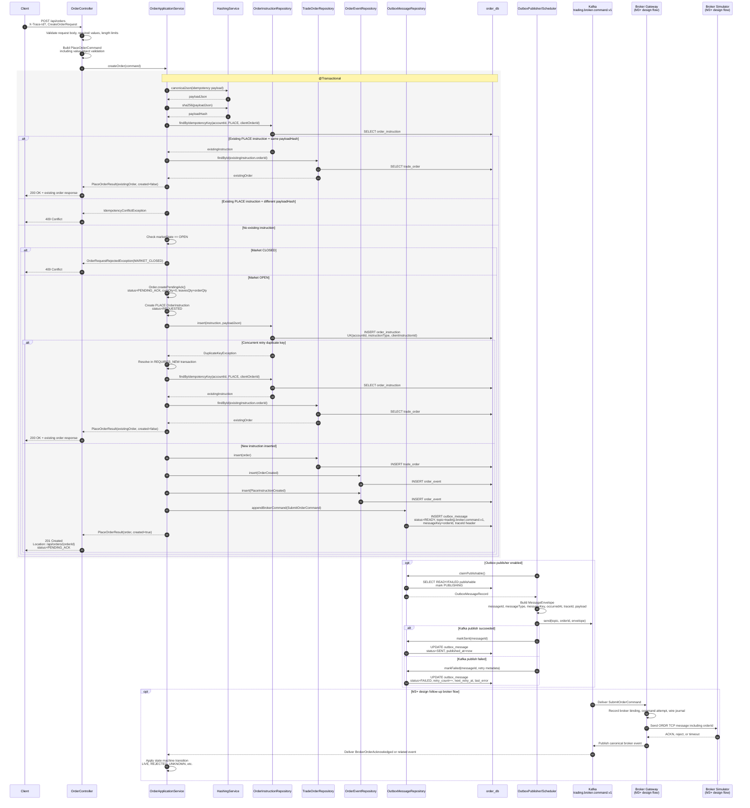
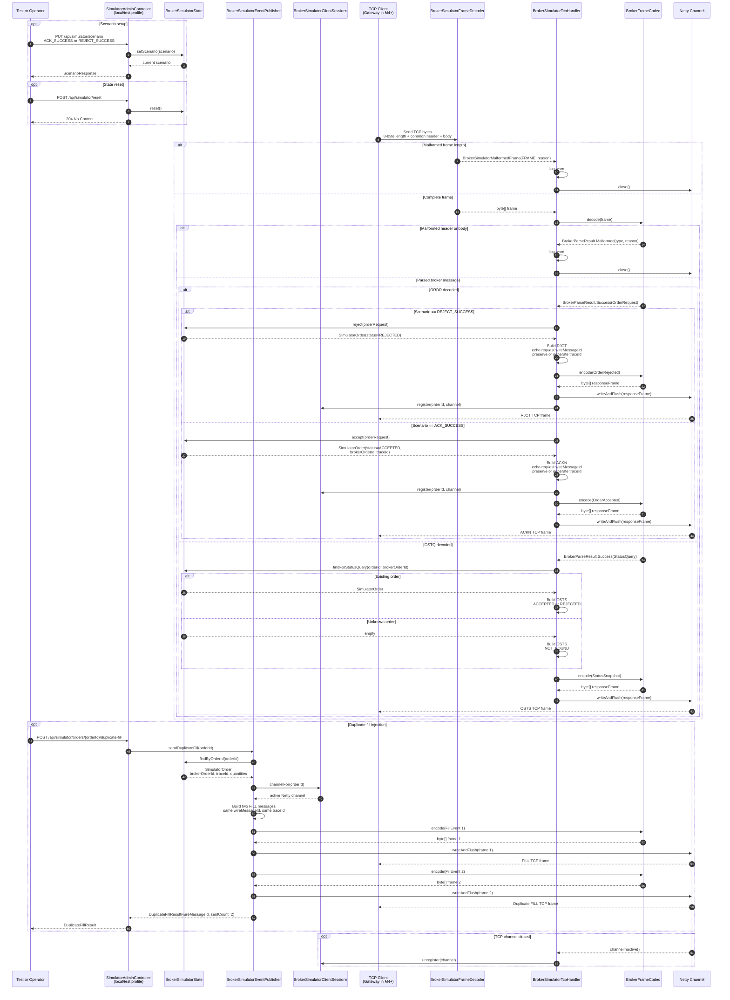

# 14. API Sequence Diagrams

## 14.1 목적

이 문서는 프로젝트 내 주요 사용자-facing API와 내부 처리 흐름을 sequence diagram으로 정리한다.

주요 목적은 다음이다.

1. API 요청이 어떤 application/domain/persistence/messaging 경계를 통과하는지 한눈에 확인한다.
2. 동기 API 응답 범위와 비동기 메시징 후속 처리를 분리해 설명한다.
3. 멱등성, outbox, traceId, 상태 전이 같은 핵심 invariant가 흐름에서 어디에 적용되는지 기록한다.
4. 이후 API별 설계 검토, 테스트 보강, 운영 추적 문서의 출발점으로 사용한다.

이 문서는 구현 코드의 클래스명을 일부 포함한다.
계약 수준의 API/Event/Protocol 정의는 `docs/10-api-event-protocol-spec.md`를 우선한다.

---

## 14.2 작성 규칙

새 API diagram을 추가할 때는 다음 순서를 따른다.

1. 사용자-facing request/response 범위를 먼저 표시한다.
2. 같은 DB transaction 안에서 수행되는 작업은 `rect` 또는 `Note`로 묶는다.
3. outbox/Kafka/consumer 후속 처리는 API 응답 이후의 비동기 흐름으로 분리한다.
4. 오류 흐름은 멱등성 충돌, 유효성 오류, 상태 전이 거절처럼 설계 invariant에 중요한 경우만 포함한다.
5. 아직 구현되지 않은 후속 milestone 범위는 명시적으로 표시한다.

---

## 14.3 `POST /api/orders` 신규 주문 생성

### 범위

현재 M2 구현 기준으로 `POST /api/orders`는 외부 브로커 ACK를 동기적으로 기다리지 않는다.
Order Service는 주문과 `PLACE` instruction, 주문 이벤트, `SubmitOrderCommand` outbox를 같은 DB transaction 안에 저장한 뒤 `PENDING_ACK` 응답을 반환한다.
outbox publisher가 이후 Kafka topic `trading.broker.command.v1`로 broker command를 비동기 발행한다.

### Sequence Diagram

### 핵심 포인트

* `clientOrderId`는 `order_instruction.client_instruction_id`로 저장되고, `accountId + PLACE + clientOrderId` 유니크 키로 멱등성을 보장한다.
* 동일 멱등성 키와 동일 payload는 기존 주문을 `200 OK`로 반환한다.
* 동일 멱등성 키와 다른 payload는 `409 Conflict`로 거절한다.
* 신규 주문은 `PENDING_ACK`, `cumQty = 0`, `leavesQty = orderQty`, `reconciliationStatus = NONE`으로 시작한다.
* `trade_order`, `order_instruction`, `order_event`, `outbox_message` 저장은 같은 DB transaction에 포함된다.
* 외부 브로커 호출은 API transaction 안에서 수행하지 않는다.
* `traceId`는 request header `X-Trace-Id`가 있으면 사용하고, 없으면 Order Service가 생성해 instruction과 outbox header, Kafka envelope까지 전파한다.

---

## 14.4 Broker Simulator M3 TCP 흐름

### 범위

이 diagram은 M3 구현 기준의 Broker Simulator 내부 흐름을 기록한다.
Broker Gateway는 아직 M4 이후 구현 범위이므로, 여기서는 TCP client 역할로만 표현한다.

M3 Broker Simulator는 다음 흐름을 제공한다.

* local/test profile 전용 admin API로 scenario와 in-memory state를 제어한다.
* TCP fixed-length frame을 Netty pipeline에서 분리한 뒤 `BrokerFrameCodec`으로 decode한다.
* `ORDR` 요청은 현재 scenario에 따라 `ACKN` 또는 `RJCT`로 응답한다.
* `OSTQ` 상태조회 요청은 in-memory 주문 상태를 `OSTS` snapshot으로 응답한다.
* duplicate fill admin API는 같은 논리 `FILL` frame을 같은 `wireMessageId`와 원 주문 `traceId`로 2회 전송한다.
* malformed frame/header/body는 Simulator 주문 상태를 변경하지 않고 log 후 connection close로 격리한다.

### Sequence Diagram

### 핵심 포인트

* `ACK_SUCCESS`에서 `ACKN` frame 직렬화는 `handleOrderRequest()`의 `write(context, response)`가 공통 `write()`를 거쳐 `BrokerFrameCodec.encode(message)`를 호출하는 흐름이다.
* request/response correlation을 위해 `ACKN`, `RJCT`, `OSTS`는 요청의 `wireMessageId`를 echo한다.
* `traceId`는 요청 header에 있으면 보존하고, 없으면 Simulator가 `trace-simulator-{orderId}` 형식으로 생성한다.
* duplicate `FILL`은 원 주문의 `traceId`와 같은 `wireMessageId`를 재사용해 Gateway/Order Service의 dedup 검증 입력으로 사용한다.
* malformed 입력은 상태 저장소를 변경하지 않는다. 현재 M3 Simulator 정책은 WARN log 후 channel close이며, Gateway journal/metric 연결은 M4 이후 범위다.
